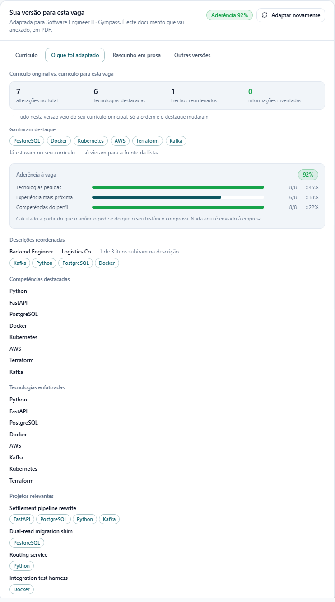
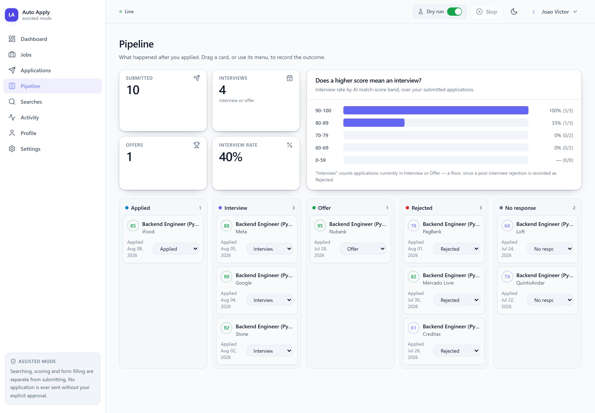
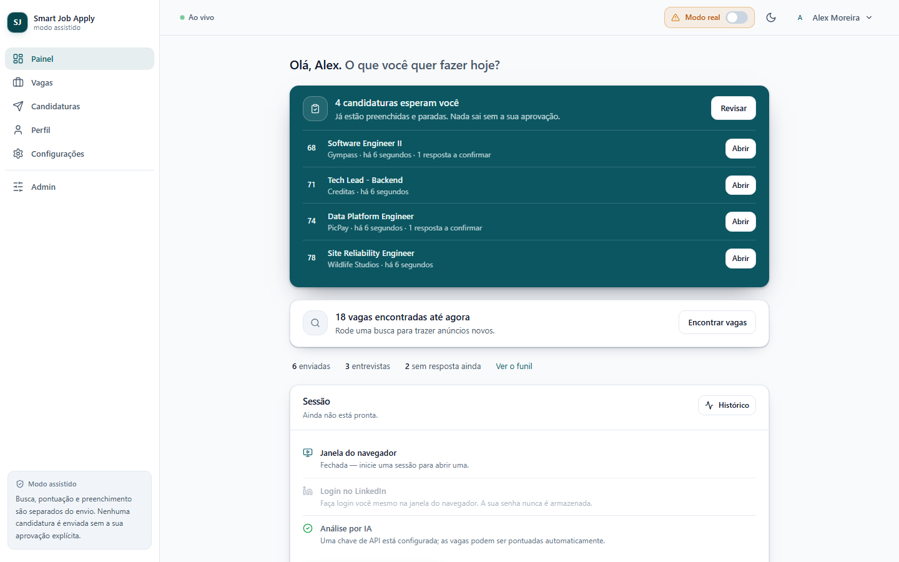
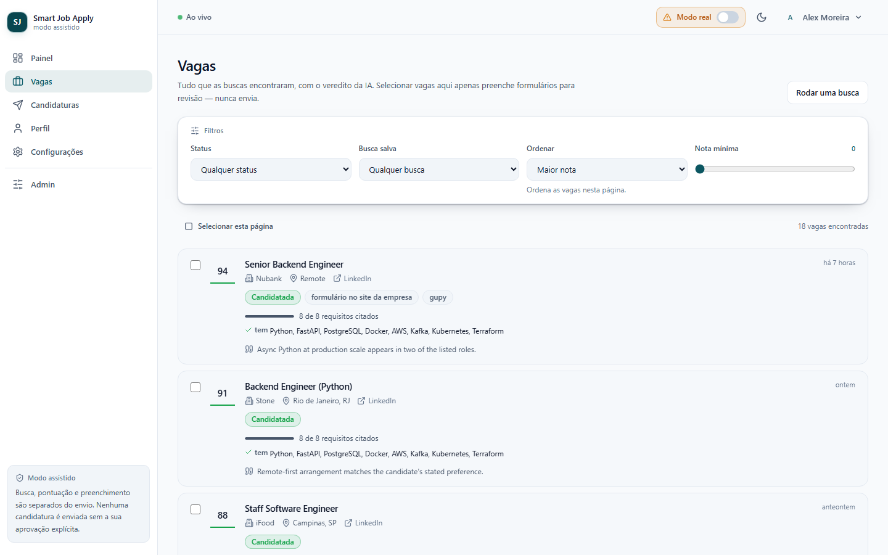
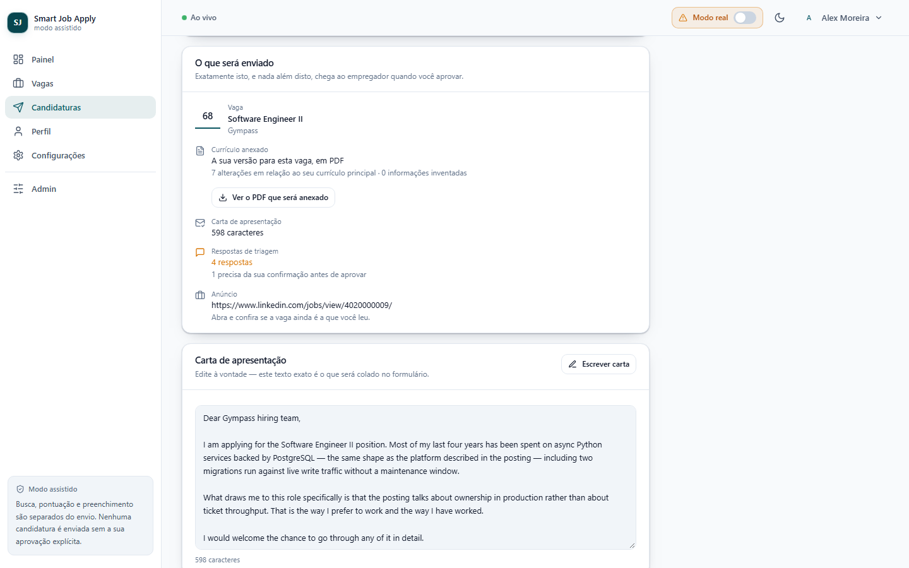
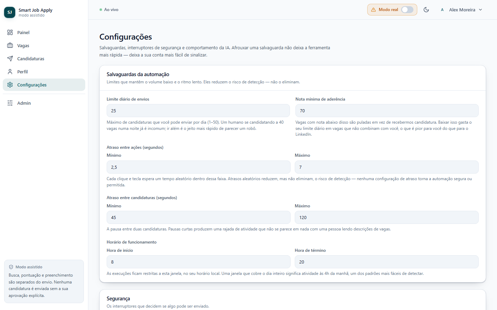
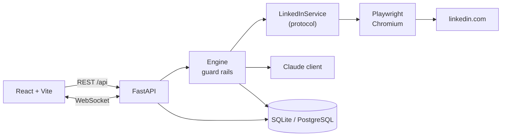

# LinkedIn Auto Apply

An assisted job-application agent for LinkedIn Easy Apply. It finds jobs, scores them against your CV with
Claude, drafts the screening answers and the cover letter, fills the form — and then **stops and waits for
you to read it and approve** before anything is sent.

[](https://www.python.org/)
[](https://react.dev/)
[](https://fastapi.tiangolo.com/)
[](LICENSE)

---

> ## ⚠️ Read this before you install anything
>
> **This tool automates the LinkedIn web interface by driving a real browser.**
>
> **LinkedIn's User Agreement prohibits automated access.** Scrapers, bots, and browser automation are all
> named. There is no reading of the Agreement under which this is permitted.
>
> **Using it can get your account restricted or permanently banned.** At LinkedIn's discretion, with no
> appeal you are entitled to. Your network, your messages, and your profile are in that account.
>
> **LinkedIn offers no official API for searching or applying to jobs.** That is *why* this drives a
> browser. It is not a justification — it is the reason the risk exists and cannot be engineered away.
>
> **The guard rails reduce that risk. They do not eliminate it.** Randomized delays, a daily cap, a
> working-hours window, and mandatory human approval keep the tool operating conservatively — a modest
> volume you can actually read, at an unhurried pace, with a person approving every submission. They do
> nothing about browser fingerprinting, and there is no safe threshold — one unlucky session can trip a
> check.
>
> **You are responsible for your own account.** Nobody here can get a restriction reversed for you. Weigh
> the time saved against what losing the account would cost you. For plenty of people the honest answer is
> to close this tab and apply by hand.
>
> **The project never asks for or stores your LinkedIn password.** There is no field for it in the schema,
> no parameter for it in the API, and no prompt for it in the UI. You log in yourself, in a visible browser
> window. Only session cookies are kept, encrypted at rest.
>
> The full risk model is in **[docs/safety.md](docs/safety.md)**. Please actually read it.

---

## Why it exists

Applying to jobs on LinkedIn is a loop of tedium with a few minutes of real thought hidden inside it: read
the posting, decide whether you fit, retype the same salary expectation and notice period, write a cover
letter that says something specific about the company. The tedium is automatable. The judgment is not.

So this automates the tedium and hands you back the judgment, at the point where it matters:

```text
   ┌──────────┐    ┌───────────┐    ┌───────────┐    ┌───────────┐    ┌───────────┐    ┌────────┐
   │  Search  │──▶ │ AI scores │──▶ │ YOU review│──▶ │ Auto-fill │──▶ │ YOU       │──▶ │ Submit │
   │ LinkedIn │    │  0–100    │    │ the jobs  │    │ the form  │    │ approve   │    │        │
   └──────────┘    └───────────┘    └───────────┘    └───────────┘    └───────────┘    └────────┘
                          │                                │                 ▲
                    below min score              stops at the review     nothing moves
                      → skipped                  step. never submits.    past here on
                                                                          its own
```

**Submission is always a separate, human-confirmed step.** Searching, scoring, and filling are three
different operations you invoke separately, and the endpoint that submits takes one application id and an
explicit `confirm: true`. There is no bulk submit and no unattended mode. That is not a setting you can flip
— it is enforced in four independent places, and a pull request that weakens it will not be merged.

Dry-run mode is on by default: the whole flow runs, right up to the final click, and sends nothing.

## Features

**Finding and scoring**

- Saved, reusable searches — keywords, location, remote/hybrid/onsite, date posted, seniority, Easy Apply
  only, with a per-run result cap so sweeps stay short
- AI fit scoring, 0–100, with the **reasons** for the score and an explicit list of **missing
  requirements** — the second list is the useful one, because it tells you what a recruiter will ask about
- A minimum-score threshold, so weak matches are skipped rather than applied to
- Deduplication by `(user, external job id)`: re-running a search never re-processes a posting

**Drafting**

- Cover letters written **in the language of the posting** — detected per job, or pinned to one language if
  you prefer
- Screening-answer suggestions drawn from your CV and a reusable answer bank (salary expectation, notice
  period, work authorization), each with a confidence level
- **Low-confidence answers are flagged for review**, never silently guessed. A `low` confidence value sets
  `needs_review` automatically, so a shaky answer cannot reach you unmarked
- Fields the AI cannot fill confidently mark the application as needing human input instead of being
  invented
- Model refusals are recorded and fall back to manual entry — which is the system working, not failing

**Review and control**

- Every application waits in `awaiting_review` with the letter and every answer editable before you approve
- A **per-job audit timeline**: every form step, every question answered, every error, timestamped with a
  JSON payload. It is what turns "the application failed" into a diagnosable event
- **Live activity over WebSocket** — jobs found, scores as they land, the moment an application is ready for
  you, with the last 200 events replayed on reconnect so a page reload rebuilds the feed
- A **kill switch** that stops a run cleanly between steps rather than mid-click, so nothing is left
  half-submitted
- **Dry-run mode**, on by default, that rehearses everything and sends nothing
- Conservative guard rails: randomized delays, a daily cap, a working-hours window, one browser session

**Safety and operations**

- **A security checkpoint halts everything.** CAPTCHA or "unusual activity" moves the run to `blocked` and
  stops. No retry, no workaround, no setting to skip it — you solve it yourself
- **LinkedIn session encrypted at rest** with Fernet, keyed via HKDF-SHA256. No password is ever stored, and
  no cookie is ever returned through the API
- Structured JSON logging with per-run context, so a run's log lines are greppable
- Token and cost accounting on every AI call
- A **multi-user data model** — the isolation that keeps one person's cookies and event feed away from
  another's, even when you are the only user
- **SQLite by default**, no database server to install; **PostgreSQL** supported by changing one environment
  variable

## Screenshots

**Tailored resume with an invention guard.** The AI reorganizes and re-emphasizes your CV for one posting —
it never adds experience you do not have — and a guard flags any technology that appears in the tailored
text but not in your profile, so a fabrication cannot slip past unseen.



**Pipeline board — does a higher score actually lead to an interview?** Applications you have submitted move
across outcome columns (Applied → Interview → Offer → Rejected → No response), and the board measures the
interview rate for each match-score band, so the AI's score is checked against real results rather than
taken on faith.



| | |
|---|---|
|  |  |
| **Dashboard** — counters, average score, what is waiting on you | **Jobs** — scored, with reasons and gaps |
|  |  |
| **Review** — the approval gate, a flagged answer, and the audit timeline | **Settings** — guard rails, dry-run toggle |

To capture your own: run the app, populate it with a dry-run search so the screens have real content, then
take a viewport screenshot at 1440×900 (`Ctrl/Cmd+Shift+P` → "Capture screenshot" in Chrome DevTools) and
save it to `docs/images/` with the filename above. **Blur or crop anything identifying** before committing —
your email, your phone number, and the contents of your CV all appear on these screens.

---

## Quick start

Two paths. Pick one.

### Prerequisites, both paths

An **Anthropic API key** from [console.anthropic.com](https://console.anthropic.com/) → API keys. The app
runs without one — you just fill the forms yourself, with no scoring and no drafted letters.

Two secrets matter, and the Docker path generates them for you:

- `SECRET_KEY` signs your login tokens. Left empty on a local install, a random one is generated per
  process, which logs you out on every restart.
- `ENCRYPTION_KEY` derives the key that encrypts your LinkedIn session. **Changing it later makes stored
  sessions permanently unreadable** — recoverable by reconnecting, but a real annoyance.

Generate one with either of these, twice, keeping the values distinct:

```bash
python -c "import secrets; print(secrets.token_urlsafe(48))"
openssl rand -base64 48
```

### Path A — Docker (recommended)

One container runs everything: the API, the built frontend, Chromium, and a noVNC bridge so you can see the
browser. Docker also pins Chromium and its system libraries, which is the part of a local install most
likely to break.

```bash
git clone https://github.com/joaovictorgcu/smart-job-apply.git
cd smart-job-apply
cp .env.example .env
```

Open `.env` and set your API key:

```dotenv
ANTHROPIC_API_KEY=sk-ant-...
```

You can leave `SECRET_KEY` and `ENCRYPTION_KEY` empty here — the container's entrypoint generates them on
first boot and stores them on the data volume, so your logins and your saved LinkedIn session survive
restarts. Set them yourself if you would rather manage them.

Build and start:

```bash
docker compose up -d --build      # or: make docker-up
docker compose logs -f            # or: make docker-logs
```

Then open **both** of these:

| URL | What it is |
|---|---|
| <http://localhost:8000> | The whole app — UI and API. Docs at [`/docs`](http://localhost:8000/docs), health at `/api/health` |
| **<http://localhost:6080>** | **noVNC — the browser's screen. This is where you log into LinkedIn.** |

That second URL is not optional. Chromium runs on a virtual display inside the container, and noVNC is the
only way to see it — to log in, to solve a security challenge, to watch a form being filled. Open it before
you start a browser session. Raw VNC on 5900 is deliberately not published; it is bound to localhost inside
the container and reachable only through that bridge.

There is no port 5173 in Docker: the backend serves the built frontend on 8000, which is why `CORS_ORIGINS`
is set to the app's own origin in `docker-compose.yml`.

Create your account at <http://localhost:8000>, or from the command line:

```bash
docker compose exec app python scripts/create_user.py --email you@example.com --name "Your Name"
```

Passwords are 10–72 characters (72 bytes is a bcrypt limit). Omit `--password` and you are prompted for it,
so it stays out of your shell history and the process list.

### Path B — Local

Needs **Python 3.11+**, **Node.js 20+**, and a desktop session — the browser has to be visible for you to
log in.

```bash
git clone https://github.com/joaovictorgcu/smart-job-apply.git
cd smart-job-apply
```

With `make` available (Linux, macOS, or WSL), the whole thing is four commands:

```bash
make install      # venv + backend deps + frontend deps + Chromium + a starter .env
make migrate      # create the database schema
make user         # create your account (prompts for the password)
make dev          # backend on :8000, frontend on :5173, Ctrl-C stops both
```

`make help` lists every target. On Windows without WSL, run the setup script directly and use the
PowerShell equivalents printed in the Makefile header:

```powershell
.\scripts\setup.ps1
```

<details>
<summary>If PowerShell blocks the script</summary>

```powershell
Set-ExecutionPolicy -Scope Process -ExecutionPolicy Bypass
.\scripts\setup.ps1
```

This allows unsigned scripts for the current session only.
</details>

<details>
<summary>Or do the whole thing by hand</summary>

```bash
python -m venv .venv
source .venv/bin/activate                    # PowerShell: .\.venv\Scripts\Activate.ps1
pip install -e ".[dev]"
playwright install chromium                  # Debian/Ubuntu: add --with-deps
cd frontend && npm ci && cd ..
cp .env.example .env                         # then set ANTHROPIC_API_KEY, SECRET_KEY, ENCRYPTION_KEY
cd backend && alembic upgrade head && cd ..
python scripts/create_user.py --email you@example.com --name "Your Name"
```
</details>

Then edit `.env` to add your API key and the two secrets, and start the two processes. `make dev` runs both;
the manual equivalent is two terminals:

```bash
# Terminal 1 — API
.venv/bin/python -m uvicorn app.main:app --reload --app-dir backend --port 8000

# Terminal 2 — dashboard
cd frontend && npm run dev
```

PowerShell:

```powershell
# Terminal 1 — API
.venv\Scripts\python -m uvicorn app.main:app --reload --app-dir backend --port 8000
```

```powershell
# Terminal 2 — dashboard
cd frontend
npm run dev
```

`--app-dir backend` is what puts the `app` package on the import path, so this works whether or not the
editable install took.

| URL | What it is |
|---|---|
| <http://localhost:5173> | The dashboard (Vite dev server, hot reload) |
| <http://localhost:8000/docs> | Live OpenAPI docs |

In local mode the browser opens as a real window on your desktop — no noVNC, no port 6080. Log in at
<http://localhost:5173> with the account `make user` created.

Exhaustive per-platform instructions, the PostgreSQL switch, upgrading, and backups:
**[docs/installation.md](docs/installation.md)**.

---

## First run walkthrough

Dry-run mode is **on by default**. Everything below happens without a single application being sent, until
you deliberately turn it off. Do at least one full pass this way.

1. **Create your account.** Register in the UI, or run `make user` / `python scripts/create_user.py`. This is
   the app's own login and has nothing to do with LinkedIn. New accounts start in dry-run mode with manual
   approval required, so a fresh install cannot submit anything before you configure it.

2. **Fill in your profile and upload your CV.** Headline, location, phone, years of experience, skills, and
   a summary. Upload the PDF you actually want employers to receive — it gets attached to Easy Apply forms,
   and its text is what the AI scores jobs against. A thin profile produces weak scores and vague letters.

3. **Fill in the answer bank.** This is the highest-value five minutes you will spend here. Salary
   expectation, notice period, work authorization, years with your main technologies. These are the
   questions every Easy Apply form asks, and a populated bank is the difference between confident answers
   and flagged guesses.

4. **Connect LinkedIn.** Start a browser session from the dashboard, then **log in manually in the browser
   window** — noVNC at <http://localhost:6080> under Docker, the desktop window locally. Complete two-factor
   authentication as normal. The app watches for the login to succeed and then encrypts and stores the
   session. It never sees your password.

5. **Save a search.** Keywords, location, remote preference, date posted. Leave "Easy Apply only" on — only
   Easy Apply forms can be filled at all. Start with `max_results` at 25.

6. **Run it.** The search finds jobs and scores them. Watch the activity feed: `job.found` as each posting
   turns up, `job.analyzed` as each score lands. Nothing is applied to.

7. **Review the scored jobs.** Sort by score. Read the reasons and — more importantly — the missing
   requirements. This is where you decide, not the model. Skip the ones you do not actually want.

8. **Preview, then prepare.** Preview reports how many jobs would be processed, how many are already
   applied to, and how much of your daily cap is left. Confirm it, and the automation opens each Easy Apply
   form, fills it, attaches your CV, and **stops at the review step**.

9. **Read the draft properly.** The cover letter and every screening answer, with low-confidence ones
   highlighted. Fix what is wrong. **Do not skip this** — the letter goes out under your name, and the
   answers are representations about you. If it says eight years of Python and you have four, change it
   before approving.

10. **Approve.** One application, one deliberate click. It submits, the audit trail records who approved
    what and when, and the job moves to `applied`.

11. **When you are ready for real submissions**, turn `dry_run` off in Settings — deliberately, having
    watched the flow at least once. Turn it back on when you are done for the day.

If a security challenge appears at any point, the run stops and the dashboard says `blocked`. **Solve it
yourself in the browser.** If it keeps happening, that is LinkedIn telling you the activity looks
automated — stop, rather than tuning delays until the warnings go away.

---

## Configuration

Two layers: environment variables (deployment) and per-user settings (operation). The `DEFAULT_*` variables
seed a new user's settings; after that the per-user values win.

### The environment variables that matter

| Variable | Default | What it does |
|---|---|---|
| `ANTHROPIC_API_KEY` | — | Enables scoring, letters, and answer suggestions. Empty is valid; you fill forms yourself |
| `SECRET_KEY` | random per process | Signs JWTs. **Set it**, or restarts log you out |
| `ENCRYPTION_KEY` | falls back to `SECRET_KEY` | Encrypts the LinkedIn session. Changing it makes stored sessions unreadable |
| `ANTHROPIC_MODEL` | `claude-opus-5` | Model used for scoring and drafting |
| `SCORING_EFFORT` | `low` | Reasoning effort for bulk scoring. Letters always use `high` |
| `DATABASE_URL` | *(empty → SQLite)* | `postgresql+asyncpg://…` to switch backends |
| `HEADLESS` | `false` | Keep it false. You need to see the browser |
| `ASSISTED_MODE_ONLY` | `true` | The no-submission-without-confirmation guarantee |
| `CORS_ORIGINS` | `["http://localhost:5173", …]` | JSON array. Add your LAN address to use the dashboard from another machine |
| `DATA_DIR` | `backend/data` | Where the database, browser profiles, and your CV live |

> List and tuple settings must be **JSON** in `.env`: `CORS_ORIGINS=["http://localhost:5173"]`,
> `DEFAULT_ACTION_DELAY_RANGE=[2.5, 7.0]`. A bare comma-separated value raises `SettingsError` at startup.

### The guard rails

Per user, editable in Settings. **Loosening these is the one part of configuration that carries real risk** —
each row in [docs/configuration.md](docs/configuration.md#guard-rails) says exactly what you trade away.

| Setting | Default | Range |
|---|---|---|
| `dry_run` | `true` | Fill everything, submit nothing |
| `require_manual_approval` | `true` | Explicit approval before any submission |
| `daily_cap` | 15 | 1–50 |
| `min_score` | 70 | 0–100 |
| `action_delay_min` / `max` | 2.5 / 7.0 s | randomized per action |
| `apply_delay_min` / `max` | 45 / 120 s | randomized per application |
| `working_hour_start` / `end` | 08:00–20:00 | local hours |
| `generate_cover_letter` | `true` | — |
| `content_language` | `job` | `job` follows the posting; or pin `en`, `pt-BR` |

Every setting, every field, every bound: **[docs/configuration.md](docs/configuration.md)**.

---

## Architecture



**The layering rule:**

```
Engine  ->  LinkedInService (protocol)  ->  Playwright
```

The engine never imports Playwright and never touches a `Page` or a `Locator`. It speaks only in plain
dataclasses — `SearchFilters`, `JobPosting`, `FormQuestion`, `ApplicationDraft`. Every CSS selector lives in
one file, `app/automation/selectors.py`.

That buys two things. When LinkedIn ships a redesign, the fix is confined to one file. And the entire
orchestration layer — guard rails, thresholds, state transitions, the approval gate — is covered by fast
offline tests against a fake `LinkedInService`, with no browser and no account. The AI layer follows the same
pattern: `JobScore`, `ScreeningAnswer`, and `CoverLetter` are the contract, so changing models does not leak
into the API.

```text
backend/
├── app/
│   ├── ai/                 # client.py, scoring.py, prompts/, schemas.py
│   ├── api/                # deps.py, errors.py, routes/ (one module per resource)
│   ├── auth/               # JWT, bcrypt, at-rest encryption, dependencies
│   ├── automation/
│   │   ├── contracts.py    # the dataclasses and the LinkedInService protocol
│   │   ├── errors.py       # retryable vs stop-now
│   │   ├── engine.py       # orchestration — no Playwright imports
│   │   ├── throttle.py     # delays, daily cap, working hours
│   │   ├── browser.py      # Playwright launch and lifecycle
│   │   ├── selectors.py    # every CSS selector, in one file
│   │   └── linkedin/       # service.py, search.py, job.py, apply.py
│   ├── services/           # application, automation, job, search, stats, user
│   ├── database/           # async engine, session, UTC datetime handling
│   ├── models/             # SQLAlchemy ORM + lifecycle enums
│   ├── observability/      # structured logging, audit trail, events
│   ├── schemas/            # Pydantic request/response models
│   ├── websocket/          # per-user live broadcast
│   ├── config.py
│   └── main.py
├── migrations/             # Alembic (alembic.ini lives in backend/)
├── tests/                  # unit/ api/ automation/ integration/ fixtures/
└── data/                   # SQLite, browser profiles, résumés — gitignored
frontend/src/               # components/ hooks/ lib/ pages/ services/ types/
docker/                     # Dockerfile, entrypoint.sh, supervisord.conf
docs/  scripts/  Makefile  docker-compose.yml
```

Layer boundaries, the full data model and why each table exists, the event flow from engine to browser tab,
and the design trade-offs: **[docs/architecture.md](docs/architecture.md)**.

**Stack** — Python 3.11+, FastAPI, SQLAlchemy 2 async, Alembic, Playwright, the Anthropic SDK, JWT + bcrypt +
Fernet; React, Vite, Tailwind CSS.

---

## Development

```bash
make test                       # pytest — offline, no account or API key needed
make lint                       # ruff check .
make format                     # ruff format + safe autofixes
make typecheck                  # mypy backend/app (advisory)
make migrate                    # alembic upgrade head
make migration m="add x"        # autogenerate a migration
cd frontend && npm run typecheck && npm run lint && npm run build
```

The test suite runs against `FakeLinkedInService` and `FakeAIClient`, with network access blocked and sleeps
capped by autouse fixtures — so it is fast, deterministic, and needs no browser. The most important
assertion in the repo is that preparing an application never reaches `submit()`.

House rules: English only, never `print()` (use `app.observability.get_logger`), comment the *why* rather
than the *what*, and keep Playwright inside `app/automation/browser.py` and `app/automation/linkedin/`.

Project layout, how to add a route or a service, how the fakes work, the migration workflow, and how to
debug the automation with a headed browser and Playwright traces:
**[docs/development.md](docs/development.md)** · **[CONTRIBUTING.md](CONTRIBUTING.md)**

---

## Troubleshooting

| Symptom | What is going on |
|---|---|
| **`ElementNotFoundError`, or a step that used to work now fails** | LinkedIn changed its markup. Fix the selector in `backend/app/automation/selectors.py` — prefer `aria-label`, `data-*`, and `role` over generated class names. This is the most common failure mode and it is a one-file fix. |
| **Run status is `blocked`, "security verification" on screen** | A security checkpoint was detected and everything halted, by design. **Solve it yourself in the browser window.** There is no bypass and there will not be one. If it recurs, stop using the tool on that account. |
| **Chromium crashes or dies on startup (Docker)** | `/dev/shm` is too small — Chromium's default in a container is 64 MB. `docker-compose.yml` already sets `shm_size: 1gb`; raise it to `2gb` and rebuild if you still hit it. |
| **The AI refused, or returned nothing** | Refusals are recorded on `AIAnalysis.was_refusal` and the application falls back to manual entry. Fill the field yourself. This is the system working. |
| **"Sessions dropped" / "could not decrypt stored data"** | `ENCRYPTION_KEY` changed (or `SECRET_KEY` did, when the former is unset). Stored sessions are unreadable with a different key. Restore the old value, or reconnect LinkedIn and log in once more. |
| **Logged out of the dashboard after every restart** | `SECRET_KEY` is unset, so a new random one is generated each start. Set it in `.env`. |
| **`SettingsError: error parsing value for field ...`** | A list or tuple setting in `.env` is not JSON. Use `[2.5, 7.0]` and `["http://localhost:5173"]`. |
| **`Executable doesn't exist at ...ms-playwright...`** | Run `playwright install chromium` inside the active virtual environment. |
| **Frontend loads, every request fails with a CORS error** | Your dashboard origin is not in `CORS_ORIGINS`. Add it and restart. |
| **An application failed and you want to know why** | `GET /api/applications/{id}/events` — the audit trail names the field, the options, and the step. Start there, not with the browser. |

More, including per-platform issues: [docs/installation.md](docs/installation.md#troubleshooting).

---

## Roadmap

Rough order, no dates. Anything that reduces human oversight is permanently out of scope.

- Résumé tailoring suggestions per job — highlighting which of your existing experience to foreground, not
  inventing any
- Application follow-up reminders and outcome tracking (replied / interview / rejected), so the score model
  has ground truth to check itself against
- Better answer-bank matching, so recurring questions stop being re-asked of the model
- Export your history to CSV
- Resumable runs surfaced in the UI (the `checkpoint` field already exists)
- A browser extension to save a job to the queue from LinkedIn directly
- Tests against recorded LinkedIn DOM fixtures, so selector breakage is caught before you hit it

**Explicitly not planned:** unattended or overnight runs, bulk submit, CAPTCHA solving, fingerprint evasion,
storing LinkedIn credentials, or anything that removes the review step.

## Contributing

Issues and pull requests welcome. Two rules are absolute: **no change may weaken the human-approval
guarantee**, and **nothing may bypass a security challenge**. Details, plus setup, branch and commit
conventions, and the pre-PR checklist, in [CONTRIBUTING.md](CONTRIBUTING.md). By participating you agree to
the [Code of Conduct](CODE_OF_CONDUCT.md).

Security issues: email **jvgcu@cesar.school** rather than opening a public issue.

## License

[MIT](LICENSE) © 2026 João Victor Uchôa

---

## Disclaimer

This project is not affiliated with, endorsed by, or connected to LinkedIn in any way. It automates the
LinkedIn web interface, which LinkedIn's User Agreement prohibits; using it may result in your account being
restricted or permanently banned, and no guard rail in this codebase can prevent that outcome — the delays,
caps, and approval gates reduce the risk without removing it. You are solely responsible for how you use
this software and for anything that happens to your account, and the author accepts no liability for lost
access, lost data, or applications sent on your behalf. Use it on your own account, at a human volume, and
read every application before you approve it.
