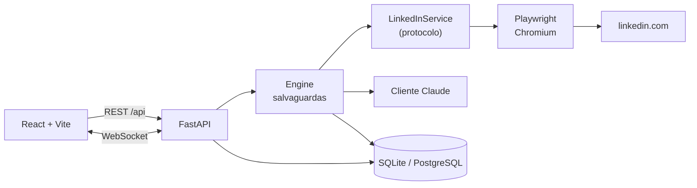

# Smart Job Apply

Um agente assistido de candidatura a vagas para o LinkedIn Easy Apply (Candidatura Simplificada). Ele encontra
vagas, pontua cada uma em relação ao seu currículo, redige as respostas de triagem e a carta de apresentação,
preenche o formulário — e então **para e espera você ler e aprovar** antes de qualquer coisa ser enviada.

O provider de IA é plugável: um modelo local via Ollama, um tier gratuito (Groq, Gemini, OpenRouter, Cerebras),
Claude, ou um provider offline determinístico para experimentar sem se cadastrar em nada.

[](https://www.python.org/)
[](https://react.dev/)
[](https://fastapi.tiangolo.com/)
[](LICENSE)

---

> ## ⚠️ Leia isto antes de instalar qualquer coisa
>
> **Esta ferramenta automatiza a interface web do LinkedIn dirigindo um navegador real.**
>
> **O Contrato de Usuário do LinkedIn proíbe o acesso automatizado.** Scrapers, bots e automação de navegador estão
> todos citados. Não existe leitura do Contrato sob a qual isto seja permitido.
>
> **Usá-la pode fazer a sua conta ser restringida ou banida permanentemente.** A critério do LinkedIn, sem
> recurso a que você tenha direito. A sua rede, as suas mensagens e o seu perfil estão nessa conta.
>
> **O LinkedIn não oferece nenhuma API oficial para buscar ou se candidatar a vagas.** É *por isso* que isto dirige um
> navegador. Não é uma justificativa — é o motivo de o risco existir e não poder ser eliminado por engenharia.
>
> **As salvaguardas reduzem esse risco. Elas não o eliminam.** Atrasos aleatórios, um limite diário, uma
> janela de horário e a aprovação humana obrigatória mantêm a ferramenta operando de forma conservadora — um volume
> modesto que você consegue de fato ler, num ritmo sem pressa, com uma pessoa aprovando cada envio. Elas não
> fazem nada quanto ao fingerprinting do navegador, e não há limiar seguro — uma sessão azarada pode disparar uma
> verificação.
>
> **Você é responsável pela sua própria conta.** Ninguém aqui consegue reverter uma restrição para você. Pese
> o tempo economizado contra o que perder a conta custaria a você. Para muita gente a resposta honesta é
> fechar esta aba e se candidatar à mão.
>
> **O projeto nunca pede nem armazena a sua senha do LinkedIn.** Não há campo para ela no schema,
> nem parâmetro para ela na API, nem prompt para ela na UI. Você faz login você mesmo, numa janela de navegador
> visível. Apenas os cookies da sessão são guardados, criptografados em repouso.
>
> O modelo de risco completo está em **[docs/safety.md](docs/safety.md)**. Por favor, leia de verdade.

---

## Status

Honestamente: **pronto para você tentar, não validado contra o LinkedIn real.**

O que está verificado — e o que isso quer dizer:

| Área | Estado |
|---|---|
| Fluxo completo (busca → nota → preenchimento → gate → envio) | Verificado ponta a ponta, mas contra o **portal falso embutido**, não contra o LinkedIn |
| Camada Playwright (seletores, navegação de passos, "preenche mas nunca envia") | 25 testes de navegador com Chromium real |
| Gate de aprovação | Coberto por testes de backend, de navegador e de UI; o guard `ASSISTED_MODE_ONLY` falha o build se afrouxar |
| Provider de IA | 43 testes, incluindo os três modos de saída estruturada e o comportamento em recusa |
| Chave de IA por conta | Testes cobrem que a chave nunca volta pela API nem entra na auditoria, que um endpoint escolhido pelo usuário não é aceito, e que uma chave que não descriptografa **não** cai de volta na chave do servidor |
| Ritmo anti-detecção | Atrasos aleatórios cobertos por teste, com piso quando não é modo de demonstração |
| Leitura do currículo enviado | Determinística e offline; um teste estrutural exige que **toda** string extraída seja um trecho do arquivo |
| Preferências de vaga | Determinísticas; testes cobrem que nada é descartado por um motivo que o usuário não escreveu, e que uma vaga excluída não custa chamada de modelo |
| "Por que esta vaga" | Determinística e sem modelo; testes cobrem que grafia equivalente não vira lacuna falsa e que um sinônimo aproximado não esconde lacuna real |
| Comparação com o currículo principal | O orçamento de mudanças é testado item a item, e a contagem de invenções é o guarda rodando sobre o documento inteiro — zero é medido, não assumido |
| Suíte | 992 backend + 25 navegador + 138 frontend + 9 Playwright, ruff, eslint, tsc, build, 8 guards |

O que **não** está verificado, e você deve assumir como não funcionando até provar:

- **Nunca rodou contra o LinkedIn de verdade.** Nenhuma busca, nenhuma candidatura. Os seletores em
  `app/automation/selectors.py` foram conferidos por leitura contra a interface em 2026-08-11 e podem já ter
  quebrado — a marcação do LinkedIn muda sem aviso e é a parte mais frágil do projeto.
- **O deploy nunca foi executado.** `docker-compose.prod.yml` está validado como YAML e pelo guard de portas;
  a imagem não foi construída nem subida por ninguém ainda.
- **Nenhuma chave de provider configurada.** Sem `AI_API_KEY`, `Settings.ai_enabled` é `False` e as funções de
  IA ficam indisponíveis. Uma linha no `.env` resolve — veja abaixo.
- **`mypy` tem cerca de 20 erros pré-existentes**, advisory na CI, concentrados em `app/automation` e
  `app/services`.
- **A leitura do currículo enviado nunca viu um corpus de PDFs reais.** Ela é exercitada contra layouts de
  currículo escritos à mão nos testes, em português e inglês. O que ela *não pode* fazer é inventar — isso
  é estrutural e testado. O que ela pode fazer é ler menos do que existe, e é por isso que a tela de
  conferência existe e que os avisos são explícitos em vez de uma lista vazia.

Uma lacuna funcional conhecida: `GET /api/resumes/applications/{id}` responde 404 como estado vazio, o que
o frontend trata certo mas aparece como erro no console do navegador.

## Por que existe

Candidatar-se a vagas no LinkedIn é um ciclo de tédio com alguns minutos de reflexão real escondidos dentro: ler
o anúncio, decidir se você combina, redigitar a mesma pretensão salarial e aviso prévio, escrever uma carta de
apresentação que diga algo específico sobre a empresa. O tédio é automatizável. O julgamento não é.

Então isto automatiza o tédio e devolve a você o julgamento, no ponto em que ele importa:

```text
   ┌──────────┐    ┌───────────┐    ┌───────────┐    ┌───────────┐    ┌───────────┐    ┌────────┐
   │  Busca   │──▶ │ IA pontua │──▶ │VOCÊ revisa│──▶ │ Preenche  │──▶ │ VOCÊ      │──▶ │ Envia  │
   │ LinkedIn │    │  0–100    │    │ as vagas  │    │formulário │    │ aprova    │    │        │
   └──────────┘    └───────────┘    └───────────┘    └───────────┘    └───────────┘    └────────┘
                          │                                │                 ▲
                    abaixo da nota mín.          para na etapa de       nada passa
                      → pulada                   revisão. nunca envia.  daqui sozinho
```

**O envio é sempre um passo separado e confirmado por um humano.** Buscar, pontuar e preencher são três
operações diferentes que você invoca separadamente, e o endpoint que envia recebe um id de candidatura e um
`confirm: true` explícito. Não há envio em massa nem modo autônomo. Isso não é uma opção que você pode ligar
— é imposto em quatro lugares independentes, e um pull request que o enfraqueça não será aceito.

O modo de teste (dry run) está ligado por padrão: o fluxo inteiro roda, até o clique final, e não envia nada.

## Funcionalidades

**Comece pelo currículo, não por um formulário**

- Envie o PDF que você já usa e o app **lê**: nome, título, localização, contato, resumo, tecnologias,
  idiomas, experiências (cargo, empresa, período, atividades, tecnologias), formação, projetos e
  certificações. Depois mostra tudo numa tela de conferência — "encontramos estas informações" — e você
  corrige só o que estiver errado
- **Nada é inventado, e é estrutural**: toda string extraída é um trecho literal do arquivo enviado, o que
  um teste verifica campo a campo. Um currículo que nunca cita Kubernetes não produz Kubernetes em lugar
  nenhum
- **Nada é escondido**: um layout que o leitor não reconheceu aparece como aviso, nunca como uma lista
  vazia. Uma experiência cujo cargo ou empresa o layout ocultou vem em branco para você preencher, e
  bloqueia o salvamento até que venha
- **Nada é gravado antes de você confirmar.** Ler o arquivo não move um único campo do seu perfil
- Determinístico e offline: funciona igual num deploy sem chave de IA nenhuma

**Diga uma vez o que você procura**

- Cargo principal, cargos que também servem, nível, modelo de trabalho, onde, um piso salarial,
  tecnologias a destacar e **termos que você não quer nem ver**
- Informar o cargo já cria a busca "Minhas vagas" pronta para rodar — você não precisa abrir o
  formulário de busca para começar
- Uma vaga que bate num termo excluído é descartada **antes** de custar uma chamada de modelo, e o
  motivo cita a sua própria palavra: "você pediu para pular vagas com 'call center'". Comparado com
  o título, o local e o modelo de trabalho — nunca com o texto inteiro do anúncio, porque "call
  center" num parágrafo sobre os clientes da empresa não faz de uma vaga backend um call center
- Não dizer nada não descarta nada: preferência em branco deixa passar tudo, e uma vaga que não
  informa o modelo de trabalho nunca conta como incompatível
- Tecnologias prioritárias só reordenam: elas põem na frente o que a vaga já pede **e** você já tem.
  Uma prioridade que a vaga não menciona não muda nada, e uma que você não tem não aparece em lugar
  nenhum — a lista que está sendo reordenada já era a interseção das duas

**Busca e pontuação**

- Buscas salvas e reutilizáveis — palavras-chave, localização, remoto/híbrido/presencial, data de publicação, senioridade, apenas Candidatura
  Simplificada, com um limite de resultados por execução para que as varreduras fiquem curtas
- Pontuação de aderência por IA, 0–100, com os **motivos** da nota e uma lista explícita de **requisitos
  faltantes** — a segunda lista é a mais útil, porque diz o que um recrutador vai perguntar
- **"Por que esta vaga?"** ao lado da nota: o que o anúncio pede e o seu currículo cobre, e o que ele
  pede e o seu currículo não cobre. Sem IA nenhuma — é a interseção do anúncio com o seu texto, a
  mesma que monta o currículo adaptado, então um termo destacado ali é um termo listado aqui. Ninguém
  consegue conferir um "82"; essas duas listas dá para conferir
- Grafias equivalentes não viram lacuna falsa: anúncio pedindo `postgres` contra currículo dizendo
  `PostgreSQL` conta como coberto. Só sinônimos exatos — `java` e `javascript` continuam duas coisas,
  e esconder uma lacuna real para parecer generoso seria pior do que apontá-la
- Um limiar de nota mínima, para que combinações fracas sejam puladas em vez de recebermos candidatura
- Deduplicação por `(usuário, id externo da vaga)`: rodar uma busca de novo nunca reprocessa um anúncio

**Geração de texto**

- Cartas de apresentação escritas **no idioma do anúncio** — detectado por vaga, ou fixado em um idioma se
  você preferir
- Sugestões de respostas de triagem tiradas do seu currículo e de um banco de respostas reutilizável (pretensão salarial, aviso
  prévio, autorização de trabalho), cada uma com um nível de confiança
- **Respostas de baixa confiança são sinalizadas para revisão**, nunca adivinhadas em silêncio. Um valor de confiança `low` marca
  `needs_review` automaticamente, então uma resposta duvidosa não chega até você sem marcação
- Campos que a IA não consegue preencher com confiança marcam a candidatura como precisando de intervenção humana em vez de serem
  inventados
- Recusas do modelo são registradas e recorrem ao preenchimento manual — o que é o sistema funcionando, não falhando

**Um currículo por candidatura**

- Você mantém **um currículo principal** com experiências estruturadas: cargo, empresa, período e realizações,
  cada realização marcada com as tecnologias que ela envolveu de verdade
- Cada candidatura ganha a **sua própria versão** dele, montada a partir da vaga: as experiências, realizações,
  projetos e tecnologias mais próximos do anúncio vão para o topo, e a descrição de cada experiência é reescrita
  em torno do que aquela vaga pede
- Quatro candidaturas abertas — Backend .NET, Full Stack React, Python, APIs — apresentam quatro currículos
  diferentes tirados da mesma história. A mesma experiência abre com .NET numa e com React na outra
- **Nada é inventado**: a interseção é sempre com o seu próprio vocabulário, então uma vaga que exige Rust de quem
  nunca escreveu Rust não produz Rust em lugar nenhum. Sem chamada de modelo, determinístico e offline
- **Nada vaza entre candidaturas**: editar o currículo principal muda o que as próximas vão derivar e não toca
  nenhuma que já exista; editar o de uma candidatura não mexe nas outras nem no principal
- Cargo, empresa e período **não são editáveis** na versão de uma candidatura — uma versão reenfatiza o passado,
  não o reescreve
- **Currículo original vs. currículo para esta vaga**, com o orçamento de mudanças em cima: quantas
  alterações no total, quantas tecnologias ganharam destaque, quantos trechos foram reordenados e quantas
  informações foram inventadas. Depois o item a item — "3ª → 1ª, por causa de .NET e React"
- O último número é **medido**, não prometido: o guarda contra invenção roda sobre o documento inteiro,
  não só sobre a lista de tecnologias, porque uma ferramenta inventada dentro de um item é a que um
  empregador de fato lê. Zero é um resultado; qualquer outra coisa vira um alerta que nomeia os termos

**Revisão e controle**

- Toda candidatura espera em `awaiting_review` com a carta e cada resposta editáveis antes de você aprovar
- A tela abre com **o que será enviado** — vaga e nota, arquivo anexado e quantas alterações ele tem em
  relação ao seu currículo principal, tamanho da carta, quantas respostas de triagem e quantas ainda
  precisam da sua confirmação. Aprovar é uma decisão sobre o conjunto, então o conjunto vem antes dos
  editores
- Se o guarda contra invenção achou qualquer termo que o seu currículo principal não sustenta, ele aparece
  ali em vermelho, nomeado, com "isto sai em seu nome" — não dá para passar batido
- O botão de parar a automação fica na mesma linha de ações: é onde você está quando decide que ela não
  deve continuar sem você
- Uma **linha do tempo de auditoria por vaga**: cada passo do formulário, cada pergunta respondida, cada erro, com data e um
  payload JSON. É o que transforma "a candidatura falhou" num evento diagnosticável
- **Atividade ao vivo via WebSocket** — vagas encontradas, notas conforme chegam, o momento em que uma candidatura está pronta para
  você, com os últimos 200 eventos reproduzidos na reconexão para que um recarregamento de página reconstrua o feed
- Um **botão de parada** que interrompe uma execução de forma limpa entre passos, e não no meio de um clique, para que nada fique
  parcialmente enviado
- **Modo de teste (dry run)**, ligado por padrão, que ensaia tudo e não envia nada
- Salvaguardas conservadoras: atrasos aleatórios, um limite diário, uma janela de horário, uma única sessão de navegador

**Segurança e operação**

- **Uma verificação de segurança para tudo.** CAPTCHA ou "atividade incomum" move a execução para `blocked` e
  para. Sem repetição, sem contorno, sem opção para pular — você resolve você mesmo
- **Sessão do LinkedIn criptografada em repouso** com Fernet, com chave derivada via HKDF-SHA256. Nenhuma senha é armazenada, e
  nenhum cookie jamais é retornado pela API
- Log estruturado em JSON com contexto por execução, para que as linhas de log de uma execução sejam pesquisáveis com grep
- Contabilidade de tokens e custo em cada chamada de IA
- Um **modelo de dados multiusuário** — o isolamento que mantém os cookies e o feed de eventos de uma pessoa longe dos de
  outra, mesmo quando você é o único usuário
- **SQLite por padrão**, nenhum servidor de banco para instalar; **PostgreSQL** suportado trocando uma variável de
  ambiente

## Capturas de tela

**Currículo adaptado com um guarda contra invenção.** A IA reorganiza e reenfatiza o seu currículo para um anúncio —
nunca adiciona experiência que você não tem — e um guarda sinaliza qualquer tecnologia que apareça no texto adaptado
mas não no seu perfil, para que uma invenção não passe despercebida.


**Funil — uma nota maior leva mesmo a uma entrevista?** As candidaturas que você enviou se movem
por colunas de desfecho (Enviada → Entrevista → Proposta → Rejeitada → Sem resposta), e o quadro mede a
taxa de entrevista para cada faixa de nota de aderência, para que a nota da IA seja confrontada com resultados reais em vez de
aceita por fé.


| | |
|---|---|
|  |  |
| **Painel** — contadores, nota média, o que está esperando por você | **Vagas** — pontuadas, com motivos e lacunas |
|  |  |
| **Revisão** — o portão de aprovação, uma resposta sinalizada e a linha do tempo de auditoria | **Configurações** — salvaguardas, chave do modo de teste |

Para capturar as suas próprias: rode o app, popule-o com uma busca em modo de teste para que as telas tenham conteúdo real, então
tire uma captura da viewport em 1440×900 (`Ctrl/Cmd+Shift+P` → "Capture screenshot" no Chrome DevTools) e
salve em `docs/images/` com o nome de arquivo acima. **Borre ou recorte qualquer coisa identificável** antes de commitar —
o seu e-mail, o seu telefone e o conteúdo do seu currículo aparecem nessas telas.

---

## Experimente primeiro, sem configurar nada

Antes de qualquer instalação: um comando roda o produto inteiro contra um **portal de vagas falso** embutido,
com um **provedor de IA offline**. Nenhuma chave, nenhuma conta do LinkedIn, nenhuma candidatura sai da sua
máquina.

```bash
pip install -e ".[dev]" && playwright install chromium
python scripts/demo_server.py --fresh      # ou: make demo
cd frontend && npm ci && npm run dev       # em outro terminal
```

Abra <http://localhost:5173> e entre com `demo@example.com` / `demo-password-123`. Rode uma busca, prepare uma
candidatura, revise e aprove: o fluxo é o mesmo do produto real, incluindo o gate de aprovação. O "LinkedIn" que
a automação dirige é servido pelo próprio processo da API
([`app/automation/demo_portal.py`](backend/app/automation/demo_portal.py)).

Para ver as telas cheias em vez de estados vazios, popule o banco antes:

```bash
python scripts/seed_mock.py --fresh         # ou: make seed
# entra com admin@admin.com / 123
```

Semeia 18 vagas em todas as faixas de nota, 13 candidaturas cobrindo todos os status, desfechos espalhados pelo
funil, etapas de entrevista, histórico de pontuação e uma linha do tempo por candidatura. Nada é real e nada foi
enviado a lugar nenhum.

O modo de demo desliga o modo de teste (senão o formulário nunca é aberto) mas **nunca** desliga
`require_manual_approval` — é justamente essa garantia que a demo existe para mostrar.

---

## Início rápido

Dois caminhos. Escolha um.

### Pré-requisitos (ambos os caminhos)

**Um provedor de IA.** Ele pontua as vagas, escreve as cartas e rascunha as respostas de triagem. Você escolhe
qual — inclusive gratuitos:

| `AI_PROVIDER` | Custo | Precisa de chave? |
|---|---|---|
| `ollama` | grátis, roda local | não |
| `groq` | tier grátis | sim — [console.groq.com/keys](https://console.groq.com/keys) |
| `gemini` | tier grátis | sim — [aistudio.google.com/apikey](https://aistudio.google.com/apikey) |
| `openrouter` | modelos `:free` | sim — [openrouter.ai/keys](https://openrouter.ai/keys) |
| `cerebras` | tier grátis | sim — [cloud.cerebras.ai](https://cloud.cerebras.ai/) |
| `anthropic` | pago | sim — [console.anthropic.com](https://console.anthropic.com/) |
| `stub` | grátis, offline | não |

Deixe `AI_PROVIDER` vazio e o app decide: Anthropic se `ANTHROPIC_API_KEY` estiver definida, senão o provedor
offline — então um clone novo funciona de ponta a ponta sem você se cadastrar em nada.

**Com mais de uma pessoa usando a mesma instalação, cada conta traz a própria chave.** Todo tier grátis acima é
limitado *por chave*: uma chave compartilhada por dez contas é um `429` para as dez. Em **Configurações → IA** a
conta escolhe provedor e cola a chave dela; fica guardada criptografada, nunca é devolvida pela API, e é ela que
paga as chamadas daquela conta. Quem não escolhe nada herda o provedor do servidor. O que uma conta *não* pode
escolher é o endereço do provedor (`AI_BASE_URL`) nem um provedor local — numa instalação hospedada, `localhost`
é o servidor, e uma URL escolhida pelo usuário é uma requisição que o servidor faria por ele. Detalhes em
[docs/configuration.md](docs/configuration.md#credenciais-de-ia-por-conta).

**O seu currículo e as suas respostas de triagem são dados pessoais.** Por isso a recomendação é `ollama`: um
modelo local não manda nada para fora. Instale de [ollama.com](https://ollama.com), rode
`ollama pull qwen2.5:7b-instruct`, e ponha `AI_PROVIDER=ollama` no `.env`. Os tiers grátis hospedados são uma
conveniência — leia os termos deles, inclusive se os seus prompts são usados para treinamento, antes de mandar
um currículo.

Dois segredos importam, e o caminho do Docker os gera para você:

- `SECRET_KEY` assina os seus tokens de login. Deixado vazio numa instalação local, um aleatório é gerado por
  processo, o que desloga você a cada reinício.
- `ENCRYPTION_KEY` deriva a chave que criptografa a sua sessão do LinkedIn. **Mudá-la depois torna as sessões
  armazenadas permanentemente ilegíveis** — recuperável reconectando, mas um baita incômodo.

Gere uma com qualquer um destes, duas vezes, mantendo os valores distintos:

```bash
python -c "import secrets; print(secrets.token_urlsafe(48))"
openssl rand -base64 48
```

### Caminho A — Docker (recomendado)

Um contêiner roda tudo: a API, o frontend compilado, o Chromium e uma ponte noVNC para que você possa ver o
navegador. O Docker também fixa o Chromium e as bibliotecas de sistema dele, que é a parte de uma instalação local mais
propensa a quebrar.

```bash
git clone https://github.com/joaovictorgcu/smart-job-apply.git
cd smart-job-apply
cp .env.example .env
```

Abra `.env` e escolha o provedor de IA — um destes basta:

```dotenv
AI_PROVIDER=ollama                  # local, sem chave, nada sai da máquina
# AI_PROVIDER=groq                  # tier grátis
# AI_API_KEY=gsk_...
# AI_PROVIDER=anthropic             # pago
# ANTHROPIC_API_KEY=sk-ant-...
```

Você pode deixar `SECRET_KEY` e `ENCRYPTION_KEY` vazios aqui — o entrypoint do contêiner os gera no
primeiro boot e os guarda no volume de dados, para que os seus logins e a sua sessão salva do LinkedIn sobrevivam a
reinícios. Defina-os você mesmo se preferir gerenciá-los.

Compile e inicie:

```bash
docker compose up -d --build      # ou: make docker-up
docker compose logs -f            # ou: make docker-logs
```

Depois abra **ambos** estes:

| URL | O que é |
|---|---|
| <http://localhost:8000> | O app inteiro — UI e API. Docs em [`/docs`](http://localhost:8000/docs), saúde em `/api/health` |
| **<http://localhost:6080>** | **noVNC — a tela do navegador. É aqui que você faz login no LinkedIn.** |

Essa segunda URL não é opcional. O Chromium roda num display virtual dentro do contêiner, e o noVNC é a
única forma de vê-lo — para logar, para resolver um desafio de segurança, para acompanhar um formulário sendo preenchido. Abra-a antes
de iniciar uma sessão de navegador. O VNC bruto na 5900 é deliberadamente não publicado; ele fica vinculado ao localhost dentro
do contêiner e acessível somente por essa ponte.

Não há porta 5173 no Docker: o backend serve o frontend compilado na 8000, e é por isso que `CORS_ORIGINS`
é definido como a própria origem do app no `docker-compose.yml`.

Crie a sua conta em <http://localhost:8000>, ou pela linha de comando:

```bash
docker compose exec app python scripts/create_user.py --email you@example.com --name "Your Name"
```

As senhas têm 10–72 caracteres (72 bytes é um limite do bcrypt). Omita `--password` e você será solicitado por ela,
para que fique fora do histórico do seu shell e da lista de processos.

### Caminho B — Local

Precisa de **Python 3.11+**, **Node.js 20+** e uma sessão de desktop — o navegador precisa estar visível para você
logar.

```bash
git clone https://github.com/joaovictorgcu/smart-job-apply.git
cd smart-job-apply
```

Com `make` disponível (Linux, macOS ou WSL), tudo são quatro comandos:

```bash
make install      # venv + deps do backend + deps do frontend + Chromium + um .env inicial
make migrate      # cria o schema do banco
make user         # cria a sua conta (solicita a senha)
make dev          # backend na :8000, frontend na :5173, Ctrl-C para ambos
```

`make help` lista todos os alvos. No Windows sem WSL, rode o script de setup diretamente e use os
equivalentes em PowerShell impressos no cabeçalho do Makefile:

```powershell
.\scripts\setup.ps1
```

<details>
<summary>Se o PowerShell bloquear o script</summary>

```powershell
Set-ExecutionPolicy -Scope Process -ExecutionPolicy Bypass
.\scripts\setup.ps1
```

Isto permite scripts não assinados apenas para a sessão atual.
</details>

<details>
<summary>Ou faça tudo à mão</summary>

```bash
python -m venv .venv
source .venv/bin/activate                    # PowerShell: .\.venv\Scripts\Activate.ps1
pip install -e ".[dev]"
playwright install chromium                  # Debian/Ubuntu: adicione --with-deps
cd frontend && npm ci && cd ..
cp .env.example .env                         # depois defina AI_PROVIDER, SECRET_KEY, ENCRYPTION_KEY
cd backend && alembic upgrade head && cd ..
python scripts/create_user.py --email you@example.com --name "Your Name"
```
</details>

Depois edite `.env` para adicionar a sua chave de API e os dois segredos, e inicie os dois processos. `make dev` roda ambos;
o equivalente manual são dois terminais:

```bash
# Terminal 1 — API
.venv/bin/python -m uvicorn app.main:app --reload --app-dir backend --port 8000

# Terminal 2 — painel
cd frontend && npm run dev
```

PowerShell:

```powershell
# Terminal 1 — API
.venv\Scripts\python -m uvicorn app.main:app --reload --app-dir backend --port 8000
```

```powershell
# Terminal 2 — painel
cd frontend
npm run dev
```

`--app-dir backend` é o que coloca o pacote `app` no caminho de import, então isto funciona com ou sem o
install editável ter dado certo.

| URL | O que é |
|---|---|
| <http://localhost:5173> | O painel (servidor de dev do Vite, hot reload) |
| <http://localhost:8000/docs> | Docs OpenAPI ao vivo |

No modo local o navegador abre como uma janela real no seu desktop — sem noVNC, sem porta 6080. Faça login em
<http://localhost:5173> com a conta que o `make user` criou.

Instruções exaustivas por plataforma, a troca para PostgreSQL, atualização e backups:
**[docs/installation.md](docs/installation.md)**.

---

## Primeira execução, passo a passo

O modo de teste (dry run) está **ligado por padrão**. Tudo abaixo acontece sem uma única candidatura ser enviada, até
você deliberadamente desligá-lo. Faça pelo menos uma passagem completa desse jeito.

1. **Crie a sua conta.** Registre-se na UI, ou rode `make user` / `python scripts/create_user.py`. Este é
   o login do próprio app e não tem nada a ver com o LinkedIn. Contas novas começam em modo de teste com aprovação
   manual obrigatória, então uma instalação nova não consegue enviar nada antes de você configurá-la.

2. **Envie o seu currículo e confira o que encontramos.** Uma conta nova cai direto nessa tela. Envie o
   PDF que você realmente quer que os empregadores recebam — ele é anexado aos formulários de Candidatura
   Simplificada, e o texto dele é o que a IA usa para pontuar as vagas. O app lê o arquivo e mostra o que
   achou; você corrige o que estiver errado e salva. Nada é gravado antes disso, e nada que não esteja no
   arquivo entra no seu perfil. O que ele não conseguir ler aparece como aviso, para você completar à mão
   em **Perfil**. Um perfil raso produz notas fracas e cartas vagas.

3. **Diga que tipo de vaga você procura.** A tela seguinte do cadastro, e depois em **Perfil**. Cargo
   principal, cargos que também servem, nível, modelo de trabalho, onde, um piso salarial, o que
   destacar e o que você não quer nem ver. O cargo principal já cria a busca **Minhas vagas** pronta
   para rodar, e os termos excluídos descartam vagas antes de gastarem uma análise. Deixar em branco
   não descarta nada.

4. **Preencha o banco de respostas.** Estes são os cinco minutos de maior valor que você vai gastar aqui. Pretensão
   salarial, aviso prévio, autorização de trabalho, anos com as suas principais tecnologias. Estas são as
   perguntas que todo formulário de Candidatura Simplificada faz, e um banco preenchido é a diferença entre respostas confiantes
   e palpites sinalizados.

5. **Conecte o LinkedIn.** Inicie uma sessão de navegador pelo painel, então **faça login manualmente na janela do
   navegador** — noVNC em <http://localhost:6080> no Docker, a janela do desktop localmente. Conclua a autenticação
   de dois fatores normalmente. O app observa até o login ter sucesso e então criptografa e armazena a
   sessão. Ele nunca vê a sua senha.

6. **Rode a busca.** Se você informou o cargo principal no passo 3, a busca **Minhas vagas** já está lá
   pronta. Para uma busca à parte: palavras-chave, localização, preferência de trabalho remoto, data de
   publicação. Deixe "Apenas Candidatura Simplificada" ligado — só formulários de Candidatura
   Simplificada podem ser preenchidos. Comece com `max_results` em 25.

7. **Acompanhe.** A busca encontra vagas e as pontua. Veja o feed de atividade: `job.found` conforme cada
   anúncio aparece, `job.analyzed` conforme cada nota chega — ou o motivo, quando uma vaga bate num
   termo que você excluiu e é descartada sem análise. Nada recebe candidatura.

8. **Revise as vagas pontuadas.** Ordene por nota, mas decida pelas duas listas em cada card: o que a
   vaga pede e você tem, e o que ela pede e você não tem. É aqui que você decide, não o modelo. Pule
   as que você não quer de verdade.

9. **Pré-visualize, depois prepare.** A pré-visualização informa quantas vagas seriam processadas, quantas já foram
   candidatadas e quanto do seu limite diário resta. Confirme, e a automação abre cada formulário de Candidatura
   Simplificada, preenche, anexa o seu currículo e **para na etapa de revisão**.

10. **Leia o rascunho direito.** A tela abre com o resumo do que será enviado; abaixo dele, a carta de
    apresentação e cada resposta de triagem, com as de baixa confiança destacadas. Corrija o que estiver
    errado. **Não pule isto** — a carta sai em seu nome, e as respostas são declarações sobre você. Se diz
    oito anos de Python e você tem quatro, mude antes de aprovar.

11. **Aprove.** Uma candidatura, um clique deliberado. Ela é enviada, a trilha de auditoria registra quem aprovou
    o quê e quando, e a vaga passa para `applied`.

12. **Quando estiver pronto para envios de verdade**, desligue `dry_run` em Configurações — deliberadamente, tendo
    acompanhado o fluxo pelo menos uma vez. Ligue de novo quando terminar por hoje.

Se um desafio de segurança aparecer em qualquer ponto, a execução para e o painel diz `blocked`. **Resolva
você mesmo no navegador.** Se continuar acontecendo, é o LinkedIn dizendo que a atividade parece
automatizada — pare, em vez de ajustar atrasos até os avisos sumirem.

---

## Configuração

Duas camadas: variáveis de ambiente (implantação) e configurações por usuário (operação). As variáveis `DEFAULT_*`
semeiam as configurações de um novo usuário; depois disso os valores por usuário vencem.

### As variáveis de ambiente que importam

| Variável | Padrão | O que faz |
|---|---|---|
| `AI_PROVIDER` | decide sozinho | Quem responde: `ollama`, `groq`, `gemini`, `openrouter`, `cerebras`, `llamacpp`, `anthropic`, `stub` |
| `AI_API_KEY` | — | Chave dos provedores compatíveis com OpenAI. Não usada por `ollama`, `llamacpp` nem `stub` |
| `AI_BASE_URL` | do provedor | Sobrescreve o endpoint. Ex.: `http://localhost:11434/v1` |
| `AI_MODEL` | do provedor | Sobrescreve o modelo. Ex.: `qwen2.5:14b-instruct` |
| `ANTHROPIC_API_KEY` | — | Só para `AI_PROVIDER=anthropic`. Definir isto sem `AI_PROVIDER` seleciona o caminho pago |
| `SECRET_KEY` | aleatório por processo | Assina os JWTs. **Defina**, ou reinícios deslogam você |
| `ENCRYPTION_KEY` | recorre a `SECRET_KEY` | Criptografa a sessão do LinkedIn. Mudá-la torna as sessões armazenadas ilegíveis |
| `ANTHROPIC_MODEL` | `claude-opus-5` | Modelo usado quando o provedor é `anthropic` |
| `SCORING_EFFORT` | `low` | Esforço de raciocínio para pontuação em massa. Cartas sempre usam `high` |
| `DEMO_PORTAL` | `false` | Dirige o portal de vagas falso embutido em vez do site real. `make demo` liga por você |
| `DATABASE_URL` | *(vazio → SQLite)* | `postgresql+asyncpg://…` para trocar de backend |
| `HEADLESS` | `false` | Mantenha false. Você precisa ver o navegador |
| `ASSISTED_MODE_ONLY` | `true` | A garantia de nenhum-envio-sem-confirmação |
| `CORS_ORIGINS` | `["http://localhost:5173", …]` | Array JSON. Adicione o seu endereço de LAN para usar o painel de outra máquina |
| `DATA_DIR` | `backend/data` | Onde ficam o banco, os perfis de navegador e o seu currículo |

> Configurações de lista e tupla precisam ser **JSON** no `.env`: `CORS_ORIGINS=["http://localhost:5173"]`,
> `DEFAULT_ACTION_DELAY_RANGE=[2.5, 7.0]`. Um valor separado por vírgulas puro dispara `SettingsError` na inicialização.

### As salvaguardas

Por usuário, editáveis em Configurações. **Afrouxá-las é a única parte da configuração que carrega risco real** —
cada linha em [docs/configuration.md](docs/configuration.md#guard-rails) diz exatamente o que você abre mão.

| Configuração | Padrão | Faixa |
|---|---|---|
| `dry_run` | `true` | Preenche tudo, não envia nada |
| `require_manual_approval` | `true` | Aprovação explícita antes de qualquer envio |
| `daily_cap` | 15 | 1–50 |
| `min_score` | 70 | 0–100 |
| `action_delay_min` / `max` | 2.5 / 7.0 s | aleatório por ação |
| `apply_delay_min` / `max` | 45 / 120 s | aleatório por candidatura |
| `working_hour_start` / `end` | 08:00–20:00 | horas locais |
| `generate_cover_letter` | `true` | — |
| `content_language` | `job` | `job` segue o anúncio; ou fixe `en`, `pt-BR` |

Cada configuração, cada campo, cada limite: **[docs/configuration.md](docs/configuration.md)**.

---

## Arquitetura



**A regra de camadas:**

```
Engine  ->  LinkedInService (protocolo)  ->  Playwright
```

O engine nunca importa o Playwright e nunca toca num `Page` ou num `Locator`. Ele fala apenas em dataclasses
simples — `SearchFilters`, `JobPosting`, `FormQuestion`, `ApplicationDraft`. Todo seletor CSS vive em
um arquivo, `app/automation/selectors.py`.

Isso compra duas coisas. Quando o LinkedIn lança um redesign, a correção fica confinada a um arquivo. E toda a
camada de orquestração — salvaguardas, limiares, transições de estado, o portão de aprovação — é coberta por testes
offline rápidos contra um `LinkedInService` falso, sem navegador e sem conta. A camada de IA segue o mesmo
padrão: `JobScore`, `ScreeningAnswer` e `CoverLetter` são o contrato, então trocar de modelo não vaza
para a API.

```text
backend/
├── app/
│   ├── ai/                 # client.py, scoring.py, prompts/, schemas.py
│   ├── api/                # deps.py, errors.py, routes/ (one module per resource)
│   ├── auth/               # JWT, bcrypt, at-rest encryption, dependencies
│   ├── automation/
│   │   ├── contracts.py    # the dataclasses and the LinkedInService protocol
│   │   ├── errors.py       # retryable vs stop-now
│   │   ├── engine/         # orchestration — no Playwright imports
│   │   ├── throttle.py     # delays, daily cap, working hours
│   │   ├── browser.py      # Playwright launch and lifecycle
│   │   ├── selectors.py    # every CSS selector, in one file
│   │   └── linkedin/       # service.py, search.py, job.py, apply.py
│   ├── domain/             # the product rules, pure: scoring, resume, resume_intake,
│   │                       # technologies, language — no database, no model call
│   ├── services/           # application, automation, intake, job, resume, search, stats, user
│   ├── database/           # async engine, session, UTC datetime handling
│   ├── models/             # SQLAlchemy ORM + lifecycle enums
│   ├── observability/      # structured logging, audit trail, events
│   ├── schemas/            # Pydantic request/response models
│   ├── websocket/          # per-user live broadcast
│   ├── config.py
│   └── main.py
├── migrations/             # Alembic (alembic.ini lives in backend/)
├── tests/                  # unit/ api/ automation/ integration/ fixtures/
└── data/                   # SQLite, browser profiles, résumés — gitignored
frontend/src/               # components/ hooks/ lib/ pages/ services/ types/
docker/                     # Dockerfile, entrypoint.sh, supervisord.conf
docs/  scripts/  Makefile  docker-compose.yml
```

Para rodar num servidor em vez de localmente — VPS, Tailscale, login no LinkedIn
pelo noVNC, backup do volume: **[docs/deployment.md](docs/deployment.md)**. Leia
a abertura dele antes de expor qualquer porta.

As fronteiras de camadas, o modelo de dados completo e por que cada tabela existe, o fluxo de eventos do engine até a aba do navegador,
e os trade-offs de projeto: **[docs/architecture.md](docs/architecture.md)**.

**Stack** — Python 3.11+, FastAPI, SQLAlchemy 2 async, Alembic, Playwright, um provedor de IA plugável
(qualquer servidor compatível com OpenAI, ou o SDK da Anthropic), JWT + bcrypt + Fernet; React, Vite,
Tailwind CSS.

---

## Desenvolvimento

```bash
make test                       # pytest — offline, sem conta ou chave de API
make lint                       # ruff check .
make format                     # ruff format + autofixes seguras
make typecheck                  # mypy backend/app (consultivo)
make migrate                    # alembic upgrade head
make migration m="add x"        # gera uma migration automaticamente
cd frontend && npm run typecheck && npm run lint && npm run build
```

A suíte de testes roda contra `FakeLinkedInService` e `FakeAIClient`, com o acesso à rede bloqueado e sleeps
limitados por fixtures autouse — então é rápida, determinística e não precisa de navegador. A asserção mais importante
do repositório é que preparar uma candidatura nunca chega a `submit()`.

Regras da casa: apenas inglês, nunca `print()` (use `app.observability.get_logger`), comente o *porquê* em vez
do *o quê*, e mantenha o Playwright dentro de `app/automation/browser.py` e `app/automation/linkedin/`.

Layout do projeto, como adicionar uma rota ou um serviço, como os fakes funcionam, o fluxo de migração e como
depurar a automação com um navegador com interface e traces do Playwright:
**[docs/development.md](docs/development.md)** · **[CONTRIBUTING.md](CONTRIBUTING.md)**

---

## Solução de problemas

| Sintoma | O que está acontecendo |
|---|---|
| **`ElementNotFoundError`, ou um passo que funcionava agora falha** | O LinkedIn mudou a marcação. Corrija o seletor em `backend/app/automation/selectors.py` — prefira `aria-label`, `data-*` e `role` a nomes de classe gerados. Este é o modo de falha mais comum e é uma correção de um arquivo. |
| **O status da execução é `blocked`, "verificação de segurança" na tela** | Uma verificação de segurança foi detectada e tudo parou, por design. **Resolva você mesmo na janela do navegador.** Não há contorno e não haverá. Se recorrer, pare de usar a ferramenta nessa conta. |
| **O Chromium trava ou morre na inicialização (Docker)** | `/dev/shm` é pequeno demais — o padrão do Chromium num contêiner é 64 MB. O `docker-compose.yml` já define `shm_size: 1gb`; aumente para `2gb` e recompile se ainda bater nisso. |
| **A IA recusou, ou não retornou nada** | Recusas são registradas em `AIAnalysis.was_refusal` e a candidatura recorre ao preenchimento manual. Preencha o campo você mesmo. Isto é o sistema funcionando. |
| **"Sessões perdidas" / "não foi possível descriptografar dados armazenados"** | `ENCRYPTION_KEY` mudou (ou `SECRET_KEY` mudou, quando a primeira não está definida). Sessões armazenadas são ilegíveis com uma chave diferente. Restaure o valor antigo, ou reconecte o LinkedIn e faça login mais uma vez. |
| **Deslogado do painel a cada reinício** | `SECRET_KEY` não está definida, então uma nova aleatória é gerada a cada início. Defina-a no `.env`. |
| **`SettingsError: error parsing value for field ...`** | Uma configuração de lista ou tupla no `.env` não é JSON. Use `[2.5, 7.0]` e `["http://localhost:5173"]`. |
| **`Executable doesn't exist at ...ms-playwright...`** | Rode `playwright install chromium` dentro do ambiente virtual ativo. |
| **O frontend carrega, toda requisição falha com erro de CORS** | A origem do seu painel não está em `CORS_ORIGINS`. Adicione-a e reinicie. |
| **Uma candidatura falhou e você quer saber por quê** | `GET /api/applications/{id}/events` — a trilha de auditoria nomeia o campo, as opções e o passo. Comece por aí, não pelo navegador. |

Mais, incluindo problemas por plataforma: [docs/installation.md](docs/installation.md#troubleshooting).

---

## Roteiro

Ordem aproximada, sem datas. Qualquer coisa que reduza a supervisão humana está permanentemente fora de escopo.

- ~~Sugestões de adaptação de currículo por vaga — destacando qual da sua experiência existente colocar em primeiro
  plano, sem inventar nada~~ — feito: cada candidatura mantém a sua própria versão do currículo principal, e a aba
  "O que foi adaptado" abre com a comparação item a item — quantas alterações no total, quais tecnologias ganharam
  destaque, qual experiência foi da 3ª para a 1ª e por causa de quê, e quantas informações foram inventadas (medido,
  não prometido)
- Lembretes de acompanhamento de candidatura e rastreamento de desfecho (respondeu / entrevista / rejeitado), para que o modelo de nota
  tenha uma referência real para se conferir
- Melhor correspondência do banco de respostas, para que perguntas recorrentes parem de ser reperguntadas ao modelo
- Exportar o seu histórico para CSV
- Execuções retomáveis expostas na UI (o campo `checkpoint` já existe)
- Uma extensão de navegador para salvar uma vaga na fila direto do LinkedIn
- Testes contra fixtures de DOM gravadas do LinkedIn, para que a quebra de seletor seja pega antes de você esbarrar nela

**Explicitamente não planejado:** execuções autônomas ou noturnas, envio em massa, resolução de CAPTCHA, evasão de fingerprint,
armazenamento de credenciais do LinkedIn, ou qualquer coisa que remova a etapa de revisão.

## Como contribuir

Issues e pull requests são bem-vindos. Duas regras são absolutas: **nenhuma mudança pode enfraquecer a garantia de
aprovação humana**, e **nada pode contornar um desafio de segurança**. Detalhes, além de setup, convenções de branch e commit,
e o checklist pré-PR, em [CONTRIBUTING.md](CONTRIBUTING.md). Ao participar você concorda com o
[Código de Conduta](CODE_OF_CONDUCT.md).

Questões de segurança: envie e-mail para **jvgcu@cesar.school** em vez de abrir uma issue pública.

## Licença

[MIT](LICENSE) © 2026 João Victor Uchôa

---

## Aviso legal

Este projeto não é afiliado, endossado ou conectado ao LinkedIn de forma alguma. Ele automatiza a
interface web do LinkedIn, o que o Contrato de Usuário do LinkedIn proíbe; usá-lo pode resultar na sua conta ser
restringida ou banida permanentemente, e nenhuma salvaguarda neste código pode evitar esse desfecho — os atrasos,
limites e portões de aprovação reduzem o risco sem removê-lo. Você é o único responsável por como usa
este software e por qualquer coisa que aconteça à sua conta, e o autor não aceita nenhuma responsabilidade por acesso
perdido, dados perdidos ou candidaturas enviadas em seu nome. Use na sua própria conta, num volume humano, e
leia cada candidatura antes de aprovar.
