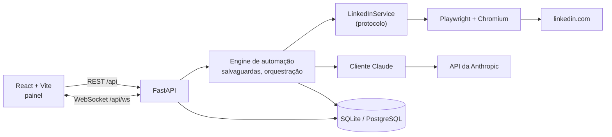
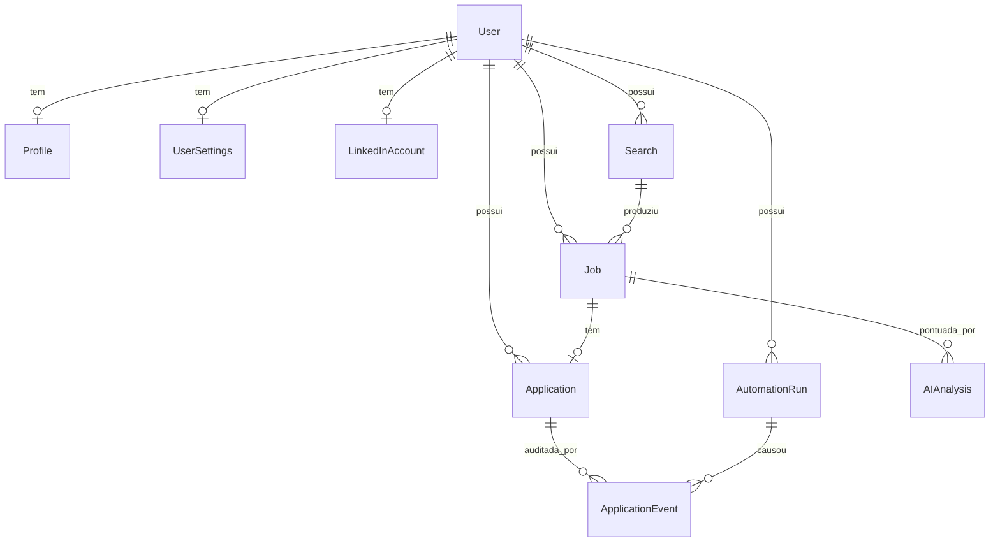
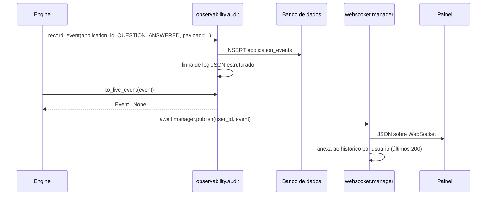

# Arquitetura

Este documento explica como as peças se encaixam, para que serve cada tabela e por que a
estrutura é do jeito que é. Se você ler apenas uma seção, leia
[Decisões de projeto](#design-decisions) — o fatiamento em camadas é o ponto central do código.

## O formato do sistema

Há três processos: um backend FastAPI, um frontend React e uma instância do Chromium dirigida
pelo Playwright. O navegador não é headless por padrão, porque o usuário precisa conseguir vê-lo,
fazer login no LinkedIn à mão e assumir o controle quando algo dá errado.



## Camadas e direção das dependências

As dependências apontam em um só sentido: camadas externas conhecem camadas internas, nunca o contrário.

| Camada | Pacote | Conhece | Nunca pode conhecer |
|---|---|---|---|
| HTTP / WS | `app.api`, `app.websocket` | schemas, services, models | Playwright, o SDK da Anthropic |
| Services | `app.services` | models, contracts, contratos de IA | objetos do Playwright, objetos do FastAPI |
| Orquestração | `app.automation.engine`, `app.automation.throttle` | contracts, contratos de IA, models | objetos do Playwright, objetos HTTP |
| Adaptador do navegador | `app.automation.browser`, `app.automation.linkedin`, `app.automation.selectors` | Playwright, `app.automation.contracts` | o ORM, FastAPI, a camada de IA |
| Adaptador de IA | `app.ai` | o SDK da Anthropic, `app.ai.schemas` | Playwright, o ORM |
| Persistência | `app.models`, `app.database` | SQLAlchemy | tudo acima dela |
| Transversal | `app.config`, `app.auth`, `app.observability` | — | — |

A regra que importa na prática:

```
Engine  ->  LinkedInService (protocolo)  ->  Playwright
```

O engine nunca importa o Playwright e nunca vê um `Page`, `Locator` ou `ElementHandle`. Ele
fala nas dataclasses simples definidas em
[`automation/contracts.py`](../backend/app/automation/contracts.py): `SearchFilters`,
`JobPosting`, `FormQuestion`, `FormAnswer`, `ApplicationDraft`, `SessionState`, `ProfileContext`.
O próprio Playwright fica confinado a `automation/browser.py` (launch e ciclo de vida) e
`automation/linkedin/` (`service.py`, `search.py`, `job.py`, `apply.py`), e todo seletor CSS e
todo pedaço de conhecimento de DOM específico do LinkedIn vive em
[`automation/selectors.py`](../backend/app/automation/selectors.py). Quando o LinkedIn lança um redesign,
esse único arquivo deveria ser o diff inteiro.

A camada de IA segue o mesmo padrão. `JobScore`, `ScreeningAnswer`, `CoverLetter` e
`JobAnalysis` em [`ai/schemas.py`](../backend/app/ai/schemas.py) são o contrato; trocar o
modelo, ou o provedor inteiro, não vaza para a camada da API.

## Modelo de dados

Dez tabelas. Cada uma existe por um motivo, e algumas delas existem especificamente para tornar as falhas
sobreviventes.



| Tabela | Por que existe |
|---|---|
| `users` | Uma conta local com um hash de senha bcrypt. Este é o login *do aplicativo*, nunca o do LinkedIn. O formato multiusuário é deliberado: é a única coisa que impede as vagas, cookies e feed de eventos de uma pessoa de alcançarem os de outra, mesmo quando você é o único usuário. |
| `profiles` | O seu currículo como texto mais um `answer_bank` de respostas reutilizáveis (pretensão salarial, aviso prévio, autorização de trabalho). A IA lê isto; é o que faz as respostas de triagem serem suas em vez de inventadas. |
| `user_settings` | Salvaguardas e preferências de IA por usuário. Separada de `profiles` porque são botões operacionais com implicações de segurança, não identidade. |
| `linkedin_accounts` | O storage state criptografado do Playwright (cookies) mais um caminho de perfil de navegador. Uma linha por usuário, e nenhuma coluna de senha em lugar nenhum do schema. |
| `searches` | Um conjunto de filtros nomeado e reutilizável. Salvo em vez de ad-hoc para que uma execução seja reproduzível e `max_results` limite o tamanho da varredura. |
| `jobs` | Um anúncio descoberto mais a sua nota, motivos da nota e requisitos faltantes. `UNIQUE (user_id, external_id)` é a garantia de deduplicação — rodar uma busca de novo nunca reprocessa nem se recandidata ao mesmo anúncio. |
| `applications` | Uma linha por vaga, `UNIQUE (job_id)`. Guarda a carta de apresentação gerada, as respostas de triagem, os contadores de etapas do formulário e a flag `was_dry_run`. O seu `status` é onde vive o invariante de aprovação humana: `AWAITING_REVIEW` é uma parada total. |
| `application_events` | Uma trilha de auditoria só de inserção: cada etapa do formulário, cada pergunta respondida, cada erro, com um timestamp e um payload JSON. |
| `ai_analyses` | A saída bruta de cada chamada ao modelo com contagens de tokens, latência, custo e uma flag `was_refusal`. Auditabilidade e controle de custo. |
| `automation_runs` | Uma linha por invocação do engine, com contadores, um `checkpoint`, uma flag `stop_requested` e um `blocked_reason`. |

### Por que `application_events` se justifica

A automação de navegador falha de formas quase impossíveis de raciocinar depois do fato. O
formulário ganhou uma etapa. As opções de um dropdown mudaram. Uma pergunta apareceu que nunca havia
aparecido. Sem uma trilha você recebe uma linha inútil: "a candidatura falhou".

`ApplicationEvent` é só de inserção e escrito em toda transição significativa —
`FORM_OPENED`, `FORM_STEP_COMPLETED`, `QUESTION_ANSWERED`, `RESUME_UPLOADED`,
`AWAITING_REVIEW`, `USER_EDITED`, `USER_APPROVED`, `SUBMITTED`, `DISCARDED`, `ERROR`. Cada linha
carrega um `payload` JSON, então "qual pergunta quebrou, e quais eram as opções" é respondível
a partir de `GET /api/applications/{id}/events` sem reproduzir a falha. É também o recibo do usuário:
um registro do exato que foi enviado em seu nome e quando ele aprovou.

### Por que `automation_runs.checkpoint` se justifica

Uma busca por cinco páginas de resultados que morre na página quatro não deveria recomeçar da página um.
Reescanear custa tempo, gasta requisições contra o LinkedIn e aumenta o risco de parecer
automatizado. `checkpoint` é um blob JSON livre que o engine escreve conforme avança — por exemplo
`{"page": 2, "processed_ids": ["3812...", "3813..."]}` — para que uma execução retomada pule o que já está
feito.

O campo irmão é `stop_requested`. O botão de parada é *cooperativo*: `POST /api/automation/stop`
seta a flag, e o engine a verifica entre etapas e levanta `StopRequestedError`. Nada é
morto no meio de um clique, então o navegador e o banco nunca ficam num estado rasgado.

## Fluxo de eventos: do engine à aba do navegador

Duas coisas acontecem a cada etapa significativa, e elas são mantidas em sincronia por uma única função.



`record_event()` persiste a trilha durável. `to_live_event()` mapeia o tipo de evento persistido para
um dos valores de [`EventName`](../backend/app/observability/events.py) ao vivo — apenas o subconjunto que o
painel de fato precisa — e retorna `None` para o resto. `manager.publish()` distribui o envelope
para cada aba aberta daquele usuário.

Três propriedades deste design são de sustentação:

- **Publicar nunca levanta exceção.** Uma aba de navegador fechada não pode derrubar uma execução, então
  `ConnectionManager.publish` engole falhas de envio e descarta sockets mortos.
- **O histórico é reproduzido na conexão.** O manager mantém os últimos 200 eventos por usuário, então
  recarregar a página reconstrói o feed de atividade em vez de mostrar um painel vazio.
- **O isolamento é por id de usuário.** Os eventos são endereçados a um usuário, nunca transmitidos a todos.

O envelope é idêntico dos dois lados — `app/observability/events.py` espelha
`frontend/src/types/events.ts`. Veja o [catálogo de eventos](api.md#websocket-events).

## Decisões de projeto

### Modo assistido primeiro, não como uma chave

O design óbvio é um candidatador totalmente automático com uma caixa de "confirmar antes de enviar". Esse
design falha feio: um padrão ruim, um bug num leitor de config, um refactor, e ele envia
dezenas de candidaturas a empregadores reais em seu nome.

Então a parada é estrutural. `LinkedInService.fill_and_advance()` é tipado e documentado para
avançar o formulário e parar na etapa de revisão; ele não tem caminho de código para o envio.
`submit()` é um método separado, exposto como um endpoint separado
(`POST /api/applications/{id}/submit` com `confirm: true`) que age sobre uma única candidatura.
`ASSISTED_MODE_ONLY` tem padrão `true`, `dry_run` tem padrão `true`, e
`require_manual_approval` tem padrão `true`.

**Trade-off:** você não pode deixá-lo rodando sozinho, que é exatamente o recurso que algumas pessoas
querem de uma ferramenta assim. Isso é uma recusa deliberada, não um recurso inacabado.

### Uma fronteira de serviço em volta do navegador

A marcação do LinkedIn muda sem aviso, e o código do Playwright é o menos testável do
projeto — precisa de um navegador real, uma sessão real e um anúncio de vaga real.

Colocar um `Protocol` entre o engine e o Playwright compra duas coisas. Os testes ganham um
`LinkedInService` falso que retorna valores prontos de `JobPosting` e `ApplicationDraft`, então toda a
camada de orquestração — salvaguardas, limiares de pontuação, transições de estado, o portão de aprovação — é
coberta por testes offline rápidos. E a quebra é localizada: um `ElementNotFoundError` aponta para
`selectors.py`, não para a lógica de negócio.

**Trade-off:** uma indireção a mais, e as dataclasses precisam ser mantidas ao lado da
implementação. Vale a pena na primeira vez que o LinkedIn move um botão.

### SQLite por padrão

Esta é uma ferramenta de um único usuário, auto-hospedada. Exigir um servidor de banco para experimentá-la custaria
mais usuários do que jamais ganharia em throughput.

`Base.type_annotation_map` mapeia todo `datetime` para um decorador `UtcDateTime` que normaliza em
ambas as direções, porque o SQLite retorna datetimes naive e o PostgreSQL retorna aware —
sem ele, `utcnow() - row.created_at` levanta `TypeError` em um backend e funciona no outro.
O SQLite é aberto em modo WAL para que a API e o engine de automação possam escrever concorrentemente.
Trocar para PostgreSQL é uma variável de ambiente (`DATABASE_URL`) e nenhuma mudança de código.

**Trade-off:** o modelo de escritor único do SQLite seria uma restrição real com muitos usuários concorrentes.
Para uma pessoa e uma sessão de navegador não é.

### Cookies criptografados em vez de uma senha armazenada

Armazenar uma senha do LinkedIn significaria que o app poderia fazer login sozinho, o que é conveniente e
indefensável: um app auto-hospedado num laptop é um lugar ruim para uma credencial que destrava a sua
identidade profissional, e logins automatizados são muito mais propensos a disparar um desafio de segurança que
uma sessão existente.

Então o usuário faz login manualmente no navegador visível, e apenas o estado de sessão resultante é
persistido, criptografado com Fernet e uma chave derivada via HKDF-SHA256 de `ENCRYPTION_KEY` (recorrendo
a `SECRET_KEY`). Não há coluna de senha no schema para o LinkedIn, e
`LinkedInAccountRead` expõe apenas um nome de exibição e uma flag de conexão — nenhum cookie jamais sai
pela API.

**Trade-off:** as sessões expiram, e o usuário tem que fazer login de novo à mão. Além disso, mudar
`ENCRYPTION_KEY` torna as sessões armazenadas ilegíveis — recuperável reconectando, mas um baita
incômodo. Ambos são custos aceitos.

### Um botão de parada cooperativo em vez de terminação de processo

Matar o processo do navegador no meio de uma candidatura pode deixar um formulário preenchido pela metade enviado ou uma linha do banco
num estado sem sentido. Uma flag verificada entre etapas para de forma limpa, fecha o modal, registra o
motivo e marca a execução como `STOPPED`.

**Trade-off:** parar não é instantâneo — tem efeito na próxima fronteira de etapa, que
pode estar a alguns segundos dentro de um atraso aleatório.

## Modelo de falha

A [hierarquia de erros](../backend/app/automation/errors.py) separa "repetir" de "parar agora".

| Erro | `recoverable` | O que o engine faz |
|---|---|---|
| `BrowserNotReadyError` | sim | Reinicia a sessão do navegador |
| `UnexpectedPageError` | sim | Repete a etapa, depois falha a vaga e segue |
| `ElementNotFoundError` | sim | O mesmo, mas a mensagem aponta para `selectors.py` |
| `NotLoggedInError` | não | Para; o usuário precisa fazer login manualmente |
| `SecurityCheckpointError` | não | **Para tudo.** Execução → `BLOCKED`, `automation.blocked` publicado |
| `EasyApplyUnavailableError` | não | Pula a vaga |
| `AlreadyAppliedError` | não | Marca a vaga como candidatada, pula |
| `ThrottleLimitError` | não | Para a execução; uma salvaguarda recusou a ação |
| `ManualInputRequiredError` | não | Deixa a candidatura em `AWAITING_REVIEW` com `needs_human_input` |
| `StopRequestedError` | não | Botão de parada; execução → `STOPPED` |

`SecurityCheckpointError` nunca é capturado e contornado. Não há loop de repetição, nenhum
seletor alternativo, nenhuma tentativa de resolver nada. Veja [safety.md](safety.md#security-checkpoints).

## Ciclos de vida

```
JobStatus:          discovered -> analyzed -> queued -> applied
                                     \-> skipped        \-> failed

ApplicationStatus:  draft -> preparing -> awaiting_review -> submitting -> submitted
                                                \-> discarded
                                                \-> failed

AutomationRunStatus: pending -> running -> completed
                                  |-> stopped   (kill switch)
                                  |-> blocked   (security checkpoint)
                                  |-> paused
                                  \-> failed
```

`awaiting_review` é o único estado em que uma candidatura preparada pode estar antes de um humano agir. Nada
transiciona para fora dele automaticamente.
