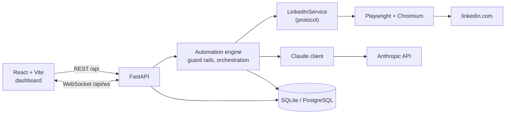
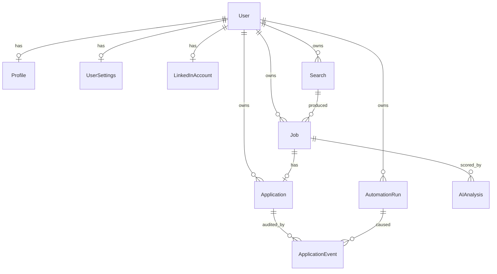
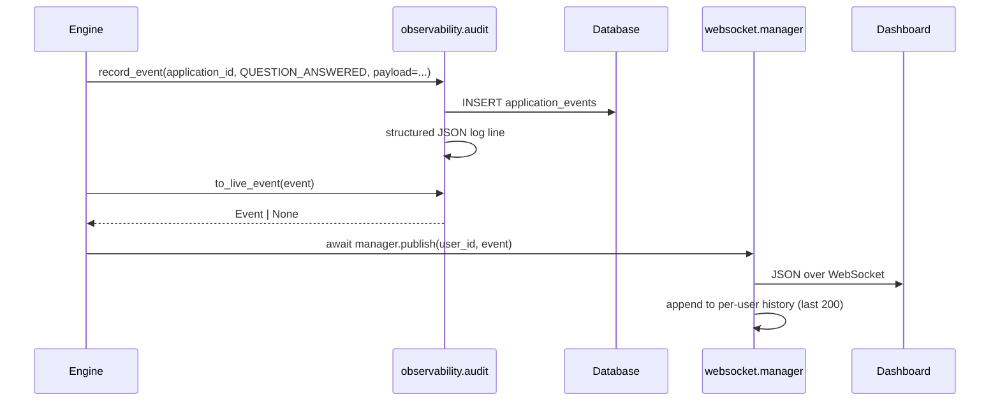

# Architecture

This document explains how the pieces fit together, what each table is for, and why the
structure is the way it is. If you only read one section, read
[Design decisions](#design-decisions) — the layering is the whole point of the codebase.

## The shape of the system

There are three processes: a FastAPI backend, a React frontend, and a Chromium instance driven
by Playwright. The browser is not headless by default, because the user has to be able to see it,
log into LinkedIn by hand, and take over when something goes wrong.



## Layers and dependency direction

Dependencies point one way only: outer layers know about inner layers, never the reverse.

| Layer | Package | Knows about | Must never know about |
|---|---|---|---|
| HTTP / WS | `app.api`, `app.websocket` | schemas, services, models | Playwright, the Anthropic SDK |
| Orchestration | `app.automation.engine` | contracts, AI contracts, models | Playwright objects, HTTP objects |
| Browser adapter | `app.automation.linkedin` | Playwright, `app.automation.contracts` | the ORM, FastAPI, the AI layer |
| AI adapter | `app.ai` | the Anthropic SDK, `app.ai.schemas` | Playwright, the ORM |
| Persistence | `app.models`, `app.database` | SQLAlchemy | everything above it |
| Cross-cutting | `app.config`, `app.auth`, `app.observability` | — | — |

The rule that matters in practice:

```
Engine  ->  LinkedInService (protocol)  ->  Playwright
```

The engine never imports Playwright and never sees a `Page`, `Locator`, or `ElementHandle`. It
speaks in the plain dataclasses defined in
[`automation/contracts.py`](../backend/app/automation/contracts.py): `SearchFilters`,
`JobPosting`, `FormQuestion`, `FormAnswer`, `ApplicationDraft`, `SessionState`, `ProfileContext`.
Every CSS selector and every piece of LinkedIn-specific DOM knowledge lives in
`app/automation/linkedin/selectors.py`. When LinkedIn ships a redesign, that file — and only that
file — should need editing.

The AI layer follows the same pattern. `JobScore`, `ScreeningAnswer`, `CoverLetter`, and
`JobAnalysis` in [`ai/schemas.py`](../backend/app/ai/schemas.py) are the contract; swapping the
model, or the provider entirely, does not leak into the API layer.

## Data model

Ten tables. Each one exists for a reason, and a few of them exist specifically to make failures
survivable.



| Table | Why it exists |
|---|---|
| `users` | A local account with a bcrypt password hash. This is the *application's* login, never LinkedIn's. The multi-user shape is deliberate: it is the only thing that keeps one person's jobs, cookies, and event feed from reaching another's, even when you are the only user. |
| `profiles` | Your CV as text plus an `answer_bank` of reusable answers (salary expectation, notice period, work authorization). The AI reads this; it is what makes screening answers yours rather than invented. |
| `user_settings` | Per-user guard rails and AI preferences. Separate from `profiles` because these are operational knobs with safety implications, not identity. |
| `linkedin_accounts` | The encrypted Playwright storage state (cookies) plus a browser-profile path. One row per user, and no password column anywhere in the schema. |
| `searches` | A named, reusable filter set. Saved rather than ad-hoc so a run is reproducible and `max_results` caps the scan size. |
| `jobs` | A discovered posting plus its score, score reasons, and missing requirements. `UNIQUE (user_id, external_id)` is the deduplication guarantee — re-running a search never re-processes or re-applies to the same posting. |
| `applications` | One row per job, `UNIQUE (job_id)`. Holds the drafted cover letter, the screening answers, the form step counters, and the `was_dry_run` flag. Its `status` is where the human-approval invariant lives: `AWAITING_REVIEW` is a full stop. |
| `application_events` | An append-only audit trail: every form step, every question answered, every error, with a timestamp and a JSON payload. |
| `ai_analyses` | The raw output of every model call with token counts, latency, cost, and a `was_refusal` flag. Auditability and cost control. |
| `automation_runs` | One row per engine invocation, with counters, a `checkpoint`, a `stop_requested` flag, and a `blocked_reason`. |

### Why `application_events` earns its keep

Browser automation fails in ways that are almost impossible to reason about after the fact. The
form gained a step. A dropdown's options changed. A question appeared that had never appeared
before. Without a trail you get one useless line: "application failed."

`ApplicationEvent` is append-only and written at every meaningful transition —
`FORM_OPENED`, `FORM_STEP_COMPLETED`, `QUESTION_ANSWERED`, `RESUME_UPLOADED`,
`AWAITING_REVIEW`, `USER_EDITED`, `USER_APPROVED`, `SUBMITTED`, `DISCARDED`, `ERROR`. Each row
carries a JSON `payload`, so "which question broke it, and what were the options" is answerable
from `GET /api/applications/{id}/events` without reproducing the failure. It is also the user's
receipt: a record of exactly what was sent on their behalf and when they approved it.

### Why `automation_runs.checkpoint` earns its keep

A search over five result pages that dies on page four should not start over from page one.
Re-scanning costs time, burns requests against LinkedIn, and increases the risk of looking
automated. `checkpoint` is a free-form JSON blob the engine writes as it goes — for example
`{"page": 2, "processed_ids": ["3812...", "3813..."]}` — so a resumed run skips what is already
done.

The sibling field is `stop_requested`. The kill switch is *cooperative*: `POST /api/automation/stop`
sets the flag, and the engine checks it between steps and raises `StopRequestedError`. Nothing is
killed mid-click, so the browser and the database are never left in a torn state.

## Event flow: engine to browser tab

Two things happen for every significant step, and they are kept in sync by a single function.



`record_event()` persists the durable trail. `to_live_event()` maps the persisted event type onto
one of the live [`EventName`](../backend/app/observability/events.py) values — only the subset the
dashboard actually needs — and returns `None` for the rest. `manager.publish()` fans the envelope
out to every open tab for that user.

Three properties of this design are load-bearing:

- **Publishing never raises.** A closed browser tab must not be able to crash a run, so
  `ConnectionManager.publish` swallows send failures and drops dead sockets.
- **History is replayed on connect.** The manager keeps the last 200 events per user, so
  reloading the page rebuilds the activity feed instead of showing an empty panel.
- **Isolation is per user id.** Events are addressed to a user, never broadcast.

The envelope is identical on both sides — `app/observability/events.py` mirrors
`frontend/src/types/events.ts`. See the [event catalogue](api.md#websocket-events).

## Design decisions

### Assisted mode first, not as a toggle

The obvious design is a fully automatic applier with a "confirm before submitting" checkbox. That
design fails badly: one bad default, one bug in a config reader, one refactor, and it submits
dozens of applications to real employers under your name.

So the stop is structural instead. `LinkedInService.fill_and_advance()` is typed and documented to
advance the form and halt at the review step; it has no code path to submission.
`submit()` is a separate method, exposed as a separate endpoint
(`POST /api/applications/{id}/submit` with `confirm: true`) that acts on a single application.
`ASSISTED_MODE_ONLY` defaults to `true`, `dry_run` defaults to `true`, and
`require_manual_approval` defaults to `true`.

**Trade-off:** you cannot leave it running unattended, which is exactly the feature some people
want from a tool like this. That is a deliberate refusal, not an unfinished feature.

### A service boundary around the browser

LinkedIn's markup changes without notice, and Playwright code is the least testable code in the
project — it needs a real browser, a real session, and a real job posting.

Putting a `Protocol` between the engine and Playwright buys two things. Tests get a fake
`LinkedInService` that returns canned `JobPosting` and `ApplicationDraft` values, so the entire
orchestration layer — guard rails, scoring thresholds, state transitions, the approval gate — is
covered by fast offline tests. And breakage is localized: an `ElementNotFoundError` points at
`selectors.py`, not at business logic.

**Trade-off:** an extra indirection, and the dataclasses have to be maintained alongside the
implementation. Worth it the first time LinkedIn moves a button.

### SQLite by default

This is a single-user, self-hosted tool. Requiring a database server to try it out would cost
more users than it would ever gain in throughput.

`Base.type_annotation_map` maps every `datetime` to a `UtcDateTime` decorator that normalizes in
both directions, because SQLite returns naive datetimes and PostgreSQL returns aware ones —
without it, `utcnow() - row.created_at` raises `TypeError` on one backend and works on the other.
SQLite is opened in WAL mode so the API and the automation engine can write concurrently.
Switching to PostgreSQL is one environment variable (`DATABASE_URL`) and no code change.

**Trade-off:** SQLite's single-writer model would be a real constraint with many concurrent users.
For one person and one browser session it is not.

### Encrypted cookies rather than a stored password

Storing a LinkedIn password would mean the app could log in on its own, which is convenient and
indefensible: a self-hosted app on a laptop is a poor place for a credential that unlocks your
professional identity, and automated logins are far more likely to trip a security challenge than
an existing session is.

So the user logs in manually in the visible browser, and only the resulting session state is
persisted, Fernet-encrypted with a key derived via HKDF-SHA256 from `ENCRYPTION_KEY` (falling back
to `SECRET_KEY`). There is no password column in the schema for LinkedIn, and
`LinkedInAccountRead` exposes only a display name and a connection flag — no cookie ever leaves
through the API.

**Trade-off:** sessions expire, and the user has to log in again by hand. Also, changing
`ENCRYPTION_KEY` renders stored sessions unreadable — recoverable by reconnecting, but a real
paper cut. Both are accepted costs.

### A cooperative kill switch instead of process termination

Killing the browser process mid-application can leave a half-filled form submitted or a database
row in a nonsense state. A flag checked between steps stops cleanly, closes the modal, records the
reason, and marks the run `STOPPED`.

**Trade-off:** stopping is not instantaneous — it takes effect at the next step boundary, which
can be a few seconds into a randomized delay.

## Failure model

The [error hierarchy](../backend/app/automation/errors.py) separates "retry" from "stop now".

| Error | `recoverable` | What the engine does |
|---|---|---|
| `BrowserNotReadyError` | yes | Restart the browser session |
| `UnexpectedPageError` | yes | Retry the step, then fail the job and move on |
| `ElementNotFoundError` | yes | Same, but the message points at `selectors.py` |
| `NotLoggedInError` | no | Halt; the user must log in manually |
| `SecurityCheckpointError` | no | **Halt everything.** Run → `BLOCKED`, `automation.blocked` published |
| `EasyApplyUnavailableError` | no | Skip the job |
| `AlreadyAppliedError` | no | Mark the job as applied, skip |
| `ThrottleLimitError` | no | Stop the run; a guard rail refused the action |
| `ManualInputRequiredError` | no | Leave the application in `AWAITING_REVIEW` with `needs_human_input` |
| `StopRequestedError` | no | Kill switch; run → `STOPPED` |

`SecurityCheckpointError` is never caught and worked around. There is no retry loop, no
alternative selector, no attempt to solve anything. See [safety.md](safety.md#security-checkpoints).

## Lifecycles

```
JobStatus:          discovered -> analyzed -> queued -> applied
                                     \-> skipped        \-> failed

ApplicationStatus:  draft -> preparing -> awaiting_review -> submitting -> submitted
                                                \-> discarded
                                                \-> failed

AutomationRunStatus: pending -> running -> completed
                                  |-> stopped   (kill switch)
                                  |-> blocked   (security checkpoint)
                                  |-> paused
                                  \-> failed
```

`awaiting_review` is the only state a prepared application can be in before a human acts. Nothing
transitions out of it automatically.
